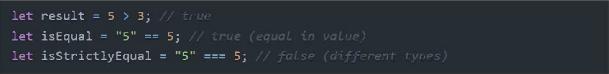
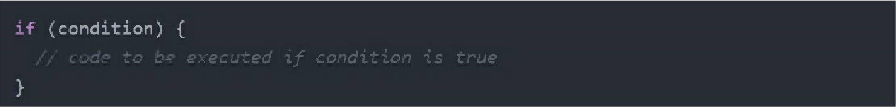
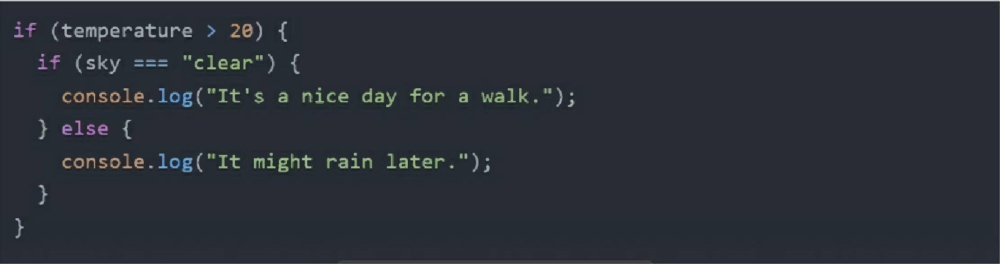
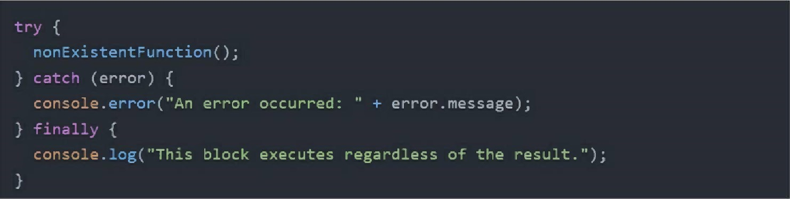
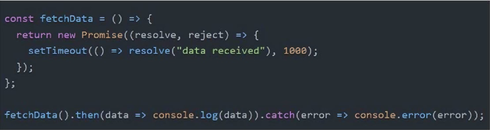

<h1>Basics of JavaScript: Unlock the power of Web Programming</h1>
<h2 align="center">JS Basics Unlock JavaScript</h2>
<br/>
<!--~~~~~~~~~~~~~~~~~~~~~~~~~~~~~~~~~~~~~~~~~~~~~~~~~~~~~~~~~~~~~~~~~~~~~~~~~~~~~~~~~~~~~~~~~~~~-->
<!--~~~~~~~~~~~~~~~~~~~~~~~~~~~~~ readme.md of js-basics-unlocked ~~~~~~~~~~~~~~~~~~~~~~~~~~~~~~-->
<!--~~~~~~~~~~~~~~~~~~~~~~~~~~~~~~~~~~~~~~~~~~~~~~~~~~~~~~~~~~~~~~~~~~~~~~~~~~~~~~~~~~~~~~~~~~~~-->
<p align="center" width="100%">

</p>
<h3 align="center">Basics of JavaScript</h3>
<!--~~~~~~~~~~~~~~~~~~~~~~~~~~~~~~~~~~~~~~~~~~~~~~~~~~~~~~~~~~~~~~~~~~~~~~~~~~~~~~~~~~~~~~~~~~~~-->
<!--~~~~~~~~~~~~~~~~~~~~~~~~~~~~~ 07. JS Basics Unlocked (01) ~~~~~~~~~~~~~~~~~~~~~~~~~~~~~~~~-->
<p align="center" width="100%">

</p>
<!-- {width="8.333333333333334in"  height="7.222222222222222in"} -->

<h2>Basics of Javascript:</h2>
<h3>Unlock the power of Web Programming</h3>
<h4>by Brian Bauska</h4>
<!--~~~~~~~~~~~~~~~~~~~~~~~~~~~~~~~~~~~~~~~~~~~~~~~~~~~~~~~~~~~~~~~~~~~~~~~~~~~~~~~~~~~~~~~~~~~~-->
<!--~~~~~~~~~~~~~~~~~~~~~~~~~~~~~ 08.  (01) ~~~~~~~~~~~~~~~~~~~~~~~~~~~~~~~~-->
<p align="center" width="100%">

</p>
<!-- {width="1.7711996937882766in" height="1.6566983814523184in"} PROGRAMMING HUB -->

<h5>US • UK • Europe • UAE , India</h5>

<h4>Basics of Javascript: Unlock the Power of Web Programming by B Bauska</h4>
<p id="table-of-contents"></p>
<h2><a href="#table-of-contents">Table of Contents - JS - Unlock for Web Programming</a></h2>
<h2>Syllabus</h2>
<h3>Course Information</h3>
<blockquote>
  <h4><a href="#ch1">1: Exploring the Basics of JavaScript</a></h4>
  <h4><a href="#ch2">2: Working with Data in JavaScript</a></h4>
  <h4><a href="#ch3">3: Controllion the Plow
</blockquote>

<h2 id="ch1">Chapter 1: Exploring the Basics of JavaScript 9 Introduction to JavaScript: Its Importance and Applications Writing Your First</h2>
<h3>JavaScript Program: The &quot;Hello World!&quot; How JavaScript Works in Web<h3>
<h4>Pages: Linking a JavaScript File</h4>

<h2 id="ch2">Chapter 2: Working with Data in JavaScript 13 Understanding JavaScript</h2>
<h3>Values and Variables Exploring</h3>

<h4>Data Types: From Numbers to Strings Declaring Variables: let, const, and var</h4>

Performing Operations: Basic Operators Understanding Operator Precedence

<h2 id="ch3">Chapter 3: Controlling the Plow 25 Making Decisions: if/else Statements</h2>

Repeating Actions: for and while Loops

Iterating over Data: Looping Through Arrays

<h2 id="ch4">Chapter 4: Functions and Scope 38 Defining and Invoking Functions</h2>

Exploring Function Declarations vs. Expressions

Arrow Functions: A Concise Syntax

Scope: Understanding Local vs. Global

<h2 id="ch5">Chapter 5: More on Functions 50 Functions Calling Functions: A Deeper Dive</h2>

Functions: Passing Values and Reference

The Power of Return Values

Understanding Callback Functions

<h2 id="ch6">Chapter 6: Arrays and Objects 64 Introduction to Arrays: Handling Collections of Data Basic and Advanced Array Operations</h2>

Understanding Objects: Key-Value Pairs

Accessing Object Properties: Dot vs. Bracket Notation

<h2 id="ch7">Chapter 7: Deeper into Objects 75 Introduction to Object-Oriented JavaScript</h2>

Understanding this Keyword

Constructors and Object Instances

Prototypes and Inheritance

Chapter 8: Asynchronous JavaScript 90 Understanding Asynchronous
JavaScript: Callbacks, Promises, and Async/Await

Making HTTP Requests: Fetch API and AJAX

Handling JSON Data

<h2 id="ch9">Chapter 9: Modern JavaScript Developments</h2>
<h3>106 ES6 and Beyond: Arrow</h3>
Functions, Classes, and Modules

Spread and Rest Operators: simplifying Arrays and Objects

Template Literals: A New Way to Handle Strings

Destructuring: Making Data Extraction Easier

<h2 id="ch10">Chapter 10: The Browser Environment</h2>
Introduction to the DOM (Document Object Model)

Selecting and Manipulating DOM Elements

Handling Events: Responding to User Input

Creating and Navigating Between Pages Dynamically

<h2 id="ch10">Chapter 11: Debugging and Error Handling</h2>
Introduction to Debugging in JavaScript

Using Browser Developer Tools

Understanding Runtime Errors and Handling Exceptions Best Practices for
Debugging

<h2 id="ch10">Chapter 12: JavaScript in the Real World</h2>

146 Building a Simple Web Application: Integrating HTML, CSS, and JavaScript Utilizing Local
Storage for Data Persistence

Deploying Your JavaScript Web Application

Where to Go from Here: Continuing Your JavaScript Journey

## Preface

Welcome to the dynamic and evolving world cf JavaScript programming This
book, &quot;Basics cfJavaScript,&#39; opens the door for those embarking on
thei_r journey into the vast landscape Of web development, software
engineering, and beyond. Crafted With the needs Of beginners in mind,
our goal is to establish a solid foundation in JavaScript, a language
celebrated for its flexibility, ubiquity, and its pivotal role in modern
web applications.

JavaScript, often referred to as the language of the web, has become an
essential skill for developers in an era dominated by the internet. Its
significance extends from creating interactive web pages to the
development of full-scale applications, both on the client and server
side. The universality cf JavaScript, running on nearly every platform
imaginable, makes it a critical asset for aspiring developers, digital
creators, and tech enthusiasts. Whether you dream ofdesigning
cutting-edge web interfaces, developing server-side applications with
Node-is, or venturing into the territories of mobile app development and
the Internet of Things C_roT), JavaScript will be your guide and
companion

AS you navigate through Basics of JavaScript,&quot; you will be introduced
to the core principles of JavaScript in manner that is both thorough and
accessible Our educational philosophy emphasizes clarity and engagement,
ensuring that beginners can understand the intricacies of JavaScript
without feeling overvthelmed. Imagine diving into the subject matter
through conversation with a mentor, one who uses real-world examples,
practical demonstrations, and a touch of humor to bring the essence of

JavaScript to lifer

Our intention is to ignite your passion for learning and to make your
educational journey as exhilarating as it is enlightening. We believe
that the process Of mastering JavaScript should spark curiosity,
challenge your thinking, and ultimately, be immensely reward_ing. TC
facilitate th_is, the book includes a variety Of exercises, projects,
and hands•cn e_xamples, encouraging you to apply What ycuve learned and
experiment beyond the page. These activities are not just instructional;
they are invitations to ex• plore the limitless possibilities that
JavaScript offers.

Commencing with &quot;Basics of JavaScript&quot; is merely the first step into a
broadere constantly changing universe ofdevelopment opportunities. The
field ofJavaScript is vibrant, with new frameworks, libraries, and best
practices emerging regularly We u_rge you to maintain a spirit of
exploration, to delve into the expansive ecosystems of front-end and
back-end JavaScript, and to always seek new problems to solve.

AS we embark on this voyage through the fascinating realm of JavaScript,
let&#39;S carry forward the traits of innovation, creativity, and the joy
of solving problems that are at the heart of programming Were thrilled
to guide you on this path and can&#39;t wait to see the amazing projects
and solutions you!ll craft with JavaScript, Heres to a journey of
creativity, discovery, and the joy of coding in JavaScript, Welcome to
&quot;Basics of JavaScript,&quot;

Happy coding!

## Acknowledgements

We, at Programming Hub, are thrilled to present this book, &quot;Basics
OfJavaScript: Unlock the Power Of Web Programming,&quot; to the aspiring
architects ofthe digital world, This book stands as a testament to the
collective efforts and unwavering dedication cf our team Ofexperts in
programming and instructional
design
<!--~~~~~~~~~~~~~~~~~~~~~~~~~~~~~~~~~~~~~~~~~~~~~~~~~~~~~~~~~~~~~~~~~~~~~~~~~~~~~~~~~~~~~~~~~~~~-->
<!--~~~~~~~~~~~~~~~~~~~~~~~~~~~~~ 09.   ~~~~~~~~~~~~~~~~~~~~~~~~~~~~~~~~-->
<p align="center" width="100%">

</p>
<!-- {width="3.125546806649169e-2in" height="3.1258748906386705e-2in"}  -->

First and foremost, we extend our deepest gratitude to all the engineers
developers, and educators who have shared their knowledge, expertise,
and passion Their commitment to excellence and their profound
understanding ofJavaScript have been pivotal in creating a comprehensive
guide for learning JavaScript.
<!--~~~~~~~~~~~~~~~~~~~~~~~~~~~~~~~~~~~~~~~~~~~~~~~~~~~~~~~~~~~~~~~~~~~~~~~~~~~~~~~~~~~~~~~~~~~~-->
<!--~~~~~~~~~~~~~~~~~~~~~~~~~~~~~ 10.   ~~~~~~~~~~~~~~~~~~~~~~~~~~~~~~~~-->
<p align="center" width="100%">

</p>
{width="4.167541557305337e-2in"
height="2.083880139982502e-2in"}

Our appreciation also goes out to our esteemed authors, who have
invested their creativity and expertise in shaping the contents ofthis
book, Their knack for demystifying complex concepts, coupled with an
engaging writing style and a dedication to clarity, has rendered this
book an invaluable resource for learners at various stages of their
journey.

We are thankful for the reviewers Who provided constructive feedback and
insights throughout the bookis development. Their keen observations and
meticulous attention to detail have greatly contributed to refining the
content, ensuring both its accuracy and effectiveness.

Our gratitude extends to the technical editors and proofreaders, who
have carefully scrutinized the manuscript to uphold the highest
standards of quality and readability,

Further, we are indebted to the talented designers and illustrators
whose visually captivating graphics, diagrams, and illustrations have
enlivened the pages Of this book. Their imaginative flair and artistic
prowess have significantly enriched the learning experience, rendering
the material not cnly more accessible but also memorable. In ad• dition,
cur heartfelt thanks go to our readers, whose zeal for learning and
eagerness to master JavaScript have been the inspiration behind th_is
book

Lastly we acknowledge our entire team at Programming Hub, whose
relentless pursuit of excellence and dedication to enriching the
learning experience have brought this endeavor to fruition,

We envisage that &quot;Basics Of JavaScript: Unlock the Power Of Web
Programming • Will spark your curiosity, bolster your learning, and
equip you With the competencies necessary to navigate the vast landscape
Of JavaScript programming, May your voyage through the world Of
JavaScript be marked by discovery, growth, and the exhilara• tion Of
unlocking the vast potential this language holds.

Happy ccd_ing and may you harness the full power Of JavaScript in your
programming endeavors! ---Programming Hub

## Exploring the Basics of JavaScript

<!-- ~~~~~~~~~~~~~~~~~~~~~~~~~~~~~~~~~~~~~~~~~~~~~~~~~~~~~~~~~~~~~~~~~~~~~~~~~~~~~~~~~~~~~~~~~~ -->
<h2 id="ch1-1">1.1 Introduction to JavaScript: Its Importance and Applications</h2>
<!-- ~~~~~~~~~~~~~~~~~~~~~~~~~~~~~~~~~~~~~~~~~~~~~~~~~~~~~~~~~~~~~~~~~~~~~~~~~~~~~~~~~~~~~~~~~~ -->
<h3 id="ch1-1-1">1.1.1 What is JavaScript? An Overview</h3>
<!-- ~~~~~~~~~~~~~~~~~~~~~~~~~~~~~~~~~~~~~~~~~~~~~~~~~~~~~~~~~~~~~~~~~~~~~~~~~~~~~~~~~~~~~~~~~~ -->

JavaScript is a dynamic programming language that is primarily used to
create interactive elements on web pages. It was developed by Netscape
in the early 1990s and has since grown to become one of the core
technologies of the World Wide Web, alongside HTML and CSS. JavaScript
enables developers to add a wide range of functionalities to web pages,
including forms validation, interactive maps, animated graphics, and
complex webpage layouts.

Unlike many other programming languages, JavaScript executes on the
client&#39;s browser, providing an immediate response to user actions
without needing to communicate with the server for every operation. This
client-side execution capability makes JavaScript a key player in
creating seamless and dynamic user experiences on the web.

<!-- ~~~~~~~~~~~~~~~~~~~~~~~~~~~~~~~~~~~~~~~~~~~~~~~~~~~~~~~~~~~~~~~~~~~~~~~~~~~~~~~~~~~~~~~~~~ -->
#### 1.1.2 The Role of JavaScript in Modern Web Development
<!-- ~~~~~~~~~~~~~~~~~~~~~~~~~~~~~~~~~~~~~~~~~~~~~~~~~~~~~~~~~~~~~~~~~~~~~~~~~~~~~~~~~~~~~~~~~~ -->

In modern web development, JavaScript plays a critical role in both
front-end and backend development, On the front end, it is used to
create dynamic and interactive user interfaces. JavaScript allows
developers to respond to user actions in real-time, making web pages
feel more like native applications.

On the back end, the introduction of Nodejs has enabled JavaScript to
run on servers as well. This means that developers can write server-side
code in JavaScript, allowing for a more unified and emcient development
process because the same language can be used across the entire stack.

<!-- ~~~~~~~~~~~~~~~~~~~~~~~~~~~~~~~~~~~~~~~~~~~~~~~~~~~~~~~~~~~~~~~~~~~~~~~~~~~~~~~~~~~~~~~~~~ -->
### I. 1.3 Applications: From Web Pages to Server-Side Development
<!-- ~~~~~~~~~~~~~~~~~~~~~~~~~~~~~~~~~~~~~~~~~~~~~~~~~~~~~~~~~~~~~~~~~~~~~~~~~~~~~~~~~~~~~~~~~~ -->

JavaScript&#39;s applications extend far beyond simple animations and
validations on web pages. With the advent of sophisticated frameworks
and tools, it now powers complex web applications, mobile apps, games,
and even Internet of Things (IOT) devices. JavaScript&#39;s non-blocking,
event-driven nature makes it particularly well-suited for developing
real-time applications, such as chatting apps and live content updates.

Additionally, server-side JavaScript, through environments like Nodejs,
has revolutionized how developers build scalable and high-performance
web servers. This full-stack capability means that JavaScript is now
used in practically every aspect of software development.

<!-- ~~~~~~~~~~~~~~~~~~~~~~~~~~~~~~~~~~~~~~~~~~~~~~~~~~~~~~~~~~~~~~~~~~~~~~~~~~~~~~~~~~~~~~~~~~ -->
<h3 id="ch1-1-4">1.1.4 JavaScript Frameworks and Libraries: Enhancing Functionality</h3>
<!-- ~~~~~~~~~~~~~~~~~~~~~~~~~~~~~~~~~~~~~~~~~~~~~~~~~~~~~~~~~~~~~~~~~~~~~~~~~~~~~~~~~~~~~~~~~~ -->
The JavaScript ecosystem is rich with frameworks and libraries designed
to simplify and enhance web development. Frameworks like Angular, React,
and Vue.js provide robust solutions for developing com-

plex single-page applications (SPAS), while libraries like jQuery make
DOM manipulation easier and more intuitive.

Frameworks and libraries not only speed up the development process but
also help maintain code quality by providing structured and maintainable
codebases. They come with pre-written code for common tasks, letting
developers focus on the unique aspects of their projects rather than
reinventing the wheel for basic functionalities.

JavaScript&#39;s importance in the web development landscape cannot be
overstated. Its evolution from a simple scripting language to a
versatile, full-stack development tool demonstrates its vital role in
crafting modern web experiences. By understanding JavaScript&#39;s core
principles and learning to leverage its frameworks and libraries,
developers can build emcient, interactive, and dynamic web applications
that stand out in the digital age.

### 1.2 Writing Your First JavaScript Program: The &quot;Hello World!&quot;

#### 1.2.1 Understanding the Structure of a JavaScript Program

A JavaScript program is made up of statements that are executed by the
browser in the order in which they appear. At its core, a JavaScript
program can be as simple as a single line of code intended to perform a
specific task. Each statement in JavaScript is usually followed by a
semicolon (;) to mark the end of the current

statement, although it&#39;s important to note that JavaScript engines can
interpret the end of statements even without the semicolon, thanks to
Automatic Semicolon Insertion (ASI).

JavaScript programs can include variables for storing data, loops for
repeating actions, functions to organize code into reusable blocks, and
much more. The basic structure hinges on these constructs to build more
complex operations and workflows.

##### 1.2.2 Creating a Simple &quot;Hello World!&quot; Script

The &quot;Hello World!&quot; program is a simple exercise that prints the string
&quot;Hello, World!&quot; on the screen. It is a traditional way to introduce a
new programming language. Here&#39;s how you can create a &quot;Hello World!&quot;
script in JavaScript:
<!--~~~~~~~~~~~~~~~~~~~~~~~~~~~~~~~~~~~~~~~~~~~~~~~~~~~~~~~~~~~~~~~~~~~~~~~~~~~~~~~~~~~~~~~~~~~~-->
<!--~~~~~~~~~~~~~~~~~~~~~~~~~~~~~ 11.   ~~~~~~~~~~~~~~~~~~~~~~~~~~~~~~~~-->
<p align="center" width="100%">

</p>

#### console. log( &#39;Hello, World! i ) ;

{width="9.710341207349082in" height="1.219080271216098in"}

This single line of JavaScript code can be included in an HTML file
within &#92;<script&#92;> tags, or in an external JavaScript file, to display
the message in the web browser&#39;s console.

##### I .2.3 Using the Browser Console to Execute JavaScript

One of the easiest ways to run JavaScript code is using the browser&#39;s
console. The console is part of the web

browser&#39;s developer tools, and it provides a way to write, manage, and
monitor JavaScript on demand.

1.  Open the Console: Right-click on a webpage, select &quot;Inspect&quot; (or
    press F12 / Cmd+Opt+I on Mac), and navigate to the &quot;Console&quot; tab

2.  Write JavaScript Code: Type your JavaScript code directly into the
    console. For example, &#39;console.log(^I^Hello, World!l); and then
    press Enter.

3.  View Output: Immediately after execution, you&#39;ll see the output
    (&quot;Hello, World!&quot;) displayed in the console.

Using the console is a great way to test and debug small snippets of
JavaScript code.

##### I .2.4 Best Practices for Writing and Organizing Your JavaScript Code

As you learn to write more complex JavaScript programs, it&#39;s important
to follow best practices to ensure your code is readable, maintainable,
and effcient:

-   Use Meaningful Variable Names: Choose clear and descriptive names
    for variables and functions.

-   Stay Consistent with Style: Whether it&#39;s how you name variables or
    how you layout your code, pick a style and stick with it.

-   Comment Your Code: Use comments to explain the purpose of blocks of
    code, making it easier for you or others to understand.

-   Avoid Global Variables: Minimize the use of global variables to
    avoid unintended interactions between different parts of your code.

-   Structure Your Code: Group related code into functions or classes to
    keep your code organized and modu-

lar.

-   Error Handling: Implement error handling to manage and respond to
    potential runtime errors.

Practicing these guidelines will help you develop a strong foundation in
writing highquality JavaScript code as you begin your programming
journey.

Working with Data in JavaScript

##### 2. I Understanding JavaScript Values and Variables

 2.1.1 What Are Values and Variables in JavaScript?

In JavaScript, the concept of values and variables is foundational. A
value refers to the actual data represented in the program, such as a
number (e.g., 5 or 2.14 ^Q^ ), a string (e.g., &#39; &quot;Hello, world!&quot; ),
or a Boolean ( true or false Essentially, values are the bits of data
that we manipulate using our programs.

Variables, on the other hand, are containers that store values. They
provide us with a way to label data with a descriptive name so our
programs can be understood more clearly by humans and manipulated more
easily by the computer. For example, instead of remembering that the
number 3.14 represents the mathematical constant Pi, we can simply store
it in a variable named
<!--~~~~~~~~~~~~~~~~~~~~~~~~~~~~~~~~~~~~~~~~~~~~~~~~~~~~~~~~~~~~~~~~~~~~~~~~~~~~~~~~~~~~~~~~~~~~-->
<!--~~~~~~~~~~~~~~~~~~~~~~~~~~~~~ 12.   ~~~~~~~~~~~~~~~~~~~~~~~~~~~~~~~~-->
<p align="center" width="100%">

</p>

{width="0.6980610236220472in"
height="0.33342410323709537in"}

<h3 id="">2.1.2 The Distinction Between Values and Variables</h3>

Understanding the distinction between values and variables is crucial
for effective programming in JavaScript. A value is an immutable piece
of data held in memory. When we use a value in a program, we are
directly referring to that data.

Variables, however, are mutable references to values. A variable does
not &quot;contain&quot; the data; it merely points to the value in memory. This
distinction matters when we start performing operations on variables or
when we assign a new value to a variable. The content of the memory
location pointed to by the variable can change, but the value itself
(for example, the number 42 or the string &quot;hello&quot; ) is immutable.

<h3 id="">2.1.3 Declaring Variables in JavaScript</h3>

JavaScript provides three keywords for declaring variables: var let&#39; ,
and const .

-   var: Before ES6 (ECMAScript 2015), ^Q^ var&#42; was the only way to
    declare a variable in JavaScript. Variables declared with var have
    function scope or are globally scoped if declared outside of a
    function, One of the downsides is that var declarations can lead to
    confusion due to variable hoisting.

-   let: Introduced in ES6, ^q^ let allows developers to declare
    block-scoped variables, significantly improving code manageability
    by confining the variable&#39;s scope to the block in which it is
    declared.

-   const: Also introduced in ES6, const is used to declare variables
    meant to be constants or whose value should not change through
    reassignment. Like let const is block-scoped.

To declare a variable, you specify the keyword followed by the variable
name: let age = 30;
<!--~~~~~~~~~~~~~~~~~~~~~~~~~~~~~~~~~~~~~~~~~~~~~~~~~~~~~~~~~~~~~~~~~~~~~~~~~~~~~~~~~~~~~~~~~~~~-->
<!--~~~~~~~~~~~~~~~~~~~~~~~~~~~~~ 13.   ~~~~~~~~~~~~~~~~~~~~~~~~~~~~~~~~-->
<p align="center" width="100%">

</p>

<!-- {width="7.293088363954506e-2in" height="7.293635170603674e-2in"}  -->

<h3 id="">2.1.4 Variable Naming Conventions and Best Practices</h3>

When naming variables in JavaScript, there are several conventions and
best practices to follow:

-   Use descriptive and meaningful names that clearly indicate what data
    the variable represents. For example, use userName instead of str&#39;
    or ^q^n
<!--~~~~~~~~~~~~~~~~~~~~~~~~~~~~~~~~~~~~~~~~~~~~~~~~~~~~~~~~~~~~~~~~~~~~~~~~~~~~~~~~~~~~~~~~~~~~-->
<!--~~~~~~~~~~~~~~~~~~~~~~~~~~~~~ 14.   ~~~~~~~~~~~~~~~~~~~~~~~~~~~~~~~~-->
<p align="center" width="100%">

</p>
<!-- {width="0.20837707786526685in" height="0.26048665791776027in"}  -->

-   Stick to camelCase for variable names (e.g., &#42; userProfile
    isLoading ).

-   For const&#42; variables that hold constant values, it&#39;s common to use
    UPPER_CASE with underscores (e.g.,
<!--~~~~~~~~~~~~~~~~~~~~~~~~~~~~~~~~~~~~~~~~~~~~~~~~~~~~~~~~~~~~~~~~~~~~~~~~~~~~~~~~~~~~~~~~~~~~-->
<!--~~~~~~~~~~~~~~~~~~~~~~~~~~~~~ 15.   ~~~~~~~~~~~~~~~~~~~~~~~~~~~~~~~~-->
<p align="center" width="100%">

</p>
<!-- {width="5.209426946631671e-2in" height="7.293635170603674e-2in"}  -->

MAX_USERS ,
<!--~~~~~~~~~~~~~~~~~~~~~~~~~~~~~~~~~~~~~~~~~~~~~~~~~~~~~~~~~~~~~~~~~~~~~~~~~~~~~~~~~~~~~~~~~~~~-->
<!--~~~~~~~~~~~~~~~~~~~~~~~~~~~~~ 16.   ~~~~~~~~~~~~~~~~~~~~~~~~~~~~~~~~-->
<p align="center" width="100%">

</p>
<!-- {width="1.5211472003499562in" height="0.29174540682414696in"} )  -->

-   Avoid using JavaScript reserved words (like new &#39;class function &#39;
    ) as variable names.
<!--~~~~~~~~~~~~~~~~~~~~~~~~~~~~~~~~~~~~~~~~~~~~~~~~~~~~~~~~~~~~~~~~~~~~~~~~~~~~~~~~~~~~~~~~~~~~-->
<!--~~~~~~~~~~~~~~~~~~~~~~~~~~~~~ 17.   ~~~~~~~~~~~~~~~~~~~~~~~~~~~~~~~~-->
<p align="center" width="100%">

</p>
<!-- {width="9.376968503937008e-2in" height="2.083880139982502e-2in"}  -->

Keep name length reasonable. While
descriptive names are good, overly long names can make your code harder
to read,

Following these conventions and best practices not only makes your code
more readable but also helps avoid some common pitfalls related to
variable declaration and naming in JavaScript.

### 2.2 Exploring Data Types: From Numbers to Strings

#### 2.2.1 Primitive Data Types: Overview and Usage

JavaScript supports several primitives, fundamental data types that
constitute the basic building blocks of code. These include:

-   Numbers: Represent both integer and floating-point numbers. -
    Strings: Represent textual data.

-   Booleans: Represent truthy ( true ) or falsy ( false ) values.

-   null: Represents an intentional absence of any object value.

-   undefined: Represents a variable that has not been assigned a value.

-   Symbols: Introduced in ES6, symbols are unique and immutable
    primitive values used as keys for object properties.

Each ofthese primitive types serves specific purposes in JavaScript
applications, from controlling flow with booleans to representing and
manipulating data with numbers and strings.

#### 2.2.2 Understanding Numbers and Mathematical Operations

In JavaScript, the Number&#42; type represents both integers and
floating-point numbers. Arithmetic operations such as addition ( &#42; + &#39;
subtraction ( - &#39; ), multiplication ( &#42; &#39; ), and division C / • ) are
available for constructing expressions with numbers. Special numerical
values under the Number type also exist, including Infinity -Infinity ,
and &#42; NaN (Not a Number). Examples of numerical operations:
<!--~~~~~~~~~~~~~~~~~~~~~~~~~~~~~~~~~~~~~~~~~~~~~~~~~~~~~~~~~~~~~~~~~~~~~~~~~~~~~~~~~~~~~~~~~~~~-->
<!--~~~~~~~~~~~~~~~~~~~~~~~~~~~~~ 18.   ~~~~~~~~~~~~~~~~~~~~~~~~~~~~~~~~-->
<p align="center" width="100%">

</p>
<!-- {width="15.430272309711286in" height="2.438159448818898in"}  -->

JavaScript also includes the Math object, which provides more complex
mathematical functions and constants, like Math.sqrt() (square root),
Math.pow() (exponentiation), and Math.PI

<!--~~~~~~~~~~~~~~~~~~~~~~~~~~~~~~~~~~~~~~~~~~~~~~~~~~~~~~~~~~~~~~~~~~~~~~~~~~~~~~~~~~~~~~~~~~~~-->
<!--~~~~~~~~~~~~~~~~~~~~~~~~~~~~~ 19.   ~~~~~~~~~~~~~~~~~~~~~~~~~~~~~~~~-->
<p align="center" width="100%">

</p>
<!-- {width="0.6980610236220472in" height="0.31258530183727035in"}  -->

#### 2.2.3 Working with Strings: Creating and Manipulating Text

Strings in JavaScript are sequences of characters used to represent
text. They can be defined using single quotes ( double quotes C &#39; or
backticks (X ^Q^ &#92;&#92; &#42; ) for template literals, which allow for
multi-line

strings and embedding variables using &#36;1) syntax.

String operations and methods are crucial for text manipulation,
including:

-   Concatenation: Combining strings using the + &#42; operator or the &#39;
    concat() method.

-   Slicing: Extracting a portion of a string using the slice() method,

-   Length: Determining the length of a string with the length property.

-   Replacing: Replacing parts of a string with another using the
    replace() method

Example of string manipulation:

#### 2.2.4 Boolean, Null, and Undefined: Special Data Types

-   Booleans represent logical values and can be either or . They are
    often used in control structures like if&#39; statements to determine
    the flow of a program.

-   null is a special value in JavaScript that represents a deliberate
    non-value. It is often used to signify that a variable intentionally
    does not point to any object or value.

-   undefined is a value automatically assigned to variables that have
    been declared but not yet assigned a value. It can also be the
    return value of functions that do not explicitly return anything.

Understanding these data types and their operations is crucial for
effectively programming in JavaScript, as they form the foundation upon
which more complex structures and logic are built.

### 2.3 Declaring Variables: let const , and var
<!--~~~~~~~~~~~~~~~~~~~~~~~~~~~~~~~~~~~~~~~~~~~~~~~~~~~~~~~~~~~~~~~~~~~~~~~~~~~~~~~~~~~~~~~~~~~~-->
<!--~~~~~~~~~~~~~~~~~~~~~~~~~~~~~ 21.   ~~~~~~~~~~~~~~~~~~~~~~~~~~~~~~~~-->
<p align="center" width="100%">

</p>
<!-- {width="7.29319772528434e-2in" height="8.335629921259842e-2in"}  -->

#### 2.3.1 Differences Between let&#39; , const , and var

-   var: This keyword declares a variable, optionally initializing it to
    a value. -declared variables are function-scoped or globally scoped
    (if declared outside of a function) and are subject to variable
    hoisting (which means they can be referenced in code before they are
    declared).

-   let: Introduced in ES6 (ECMAScript 2015), &#42; let&#42; allows the
    declaration ofblock-scoped variables, significantly reducing the
    scope in which a variable is visible compared to %vrar• . Variables
    declared with

<!--~~~~~~~~~~~~~~~~~~~~~~~~~~~~~~~~~~~~~~~~~~~~~~~~~~~~~~~~~~~~~~~~~~~~~~~~~~~~~~~~~~~~~~~~~~~~-->
<!--~~~~~~~~~~~~~~~~~~~~~~~~~~~~~ 22.   ~~~~~~~~~~~~~~~~~~~~~~~~~~~~~~~~-->
<p align="center" width="100%">

</p>
<!-- {width="0.6563856080489939in" height="0.27090660542432193in"}  -->
    
can be updated but not re-declared within the same scope.

-   const: Also introduced in ES6, const is used for declaring variables
    that are meant to remain constant after their initial assignment
    (i.e., they cannot be reassigned). Like &#39;let const provides
    block-level scope. It&#39;s important to note that while the variable
    reference is immutable, the object it points to can still be mutated
    if it is an object.

#### 2.3.2 When to Use let € vs. const

<!-- {width="7.292979002624672e-2in" height="8.335629921259842e-2in"}  -->

The choice between let and const should be guided by the intended use of the variable:

-   Use const&#39; by default for declaring variables that should not
    change after their initial assignment. This communicates intent to
    other developers and leads to safer, more predictable code.

-   Use &#42;let for variables that are expected to change, such as
    counters in a loop, or values that get reassigned during the
    execution of a function.

By following this approach, code maintainability and readability are
improved.

##### 2.3.3 The Scope of let • , &#39; const , and var

{width="8.335083114610674e-2in" height="8.335629921259842e-2in"}

-   var: Variables declared with •var are either function-scoped or
    global-scoped, meaning they are visible throughout the entire
    function or throughout the global scope if declared outside a
    function.

-   let and const: Both of these keywords allow for block-scoping, which
    limits the visibility of a variable to the block in which it&#39;s
    declared (a block is defined by curly braces {l This is a crucial
    feature for managing variable lifecycle and avoiding unintentional
    interference between different parts of a program.

#### 2.3.4 Examples and Common Pitfalls

&#45; Hoisting: var declarations are hoisted to the top of their scope,
which can lead to surprising behavior if not understood properly.

{width="15.430272309711286in"
height="1.43788823272091in"}

{width="5.209426946631671e-2in" height="7.293635170603674e-2in"}

let&#39; and const are also hoisted but not initialized, which means they cannot be
accessed before their declaration due to the temporal dead zone. 

- Block Scope vs. Function Scope:

{width="15.430272309711286in" height="3.5217858705161853in"}

&#45;

Re-declaration and Re-assignment: Understanding the differences between var let, and const, along with their scopes and proper use
cases, is critical for writing robust and error-free JavaScript code.

## 2.4 Performing Operations: Basic Operators

### 2.4.1 Arithmetic Operators and Their Use

Arithmetic operators in JavaScript include the more familiar ones such
as addition ( + ), subtraction (

{width="0.6388888888888888in" height="0.3194444444444444in"}
multiplication ( &#42; ), and division ( /
There are also the modulus or remainder operator C % ), which returns
the remainder of a division, increment ( + + and decrement ( ) operators
that increase or decrease a number by one, respectively. These operators
are used to perform mathematical calculations. For example:

{width="15.430272309711286in" height="2.92787510936133in"}

#### 2.4.2 String Operators for Concatenation

In JavaScript, the + • operator is also used for concatenating
strings. When a operator is used with strings, it joins them together
into one:

let greeting = &quot;Hello, &#39; + [&quot;world!]{.underline} &quot; , //
&quot;[Hello]{.underline}, [world!]{.underline} &quot;

{width="1.0627198162729659in" height="4.167760279965004e-2in"}

{width="1.3127712160979879in" height="0.15629155730533684in"}

Template literals, introduced in ES6, offer a more powerful way to
create and manipulate strings. Enclosed by backticks (&#92;&#92; &#92;&#92; they can
contain placeholders marked by &#36;{expression) , which are replaced by
the values of the expressions:

{width="15.430272309711286in" height="1.43788823272091in"}

#### 2.4.3 Comparison Operators and Evaluating Conditions

Comparison operators are used to compare two values and return a Boolean
value, either true or false . These include:

{width="0.8855993000874891in" height="0.18755030621172353in"}
(equal to)

{width="1.0835575240594926in" height="0.19797025371828522in"}
(strictly equal to, meaning equal in value and type)

{width="0.781411854768154in" height="0.26048665791776027in"}
(not equal to)

{width="0.9689501312335957in" height="0.26048665791776027in"}
(strictly not equal to)

{width="0.30214566929133857in" height="0.19797025371828522in"} 
&#92;> (greater than)

{width="0.7084798775153106in"
height="0.21880905511811025in"}
(less than)

{width="0.8855993000874891in"
height="0.21880905511811025in"}
(greater than or equal to)

{width="0.7397364391951006in"
height="0.14587270341207348in"}
(less than or equal to)

For example:

{width="15.430272309711286in" height="1.8963462379702538in"}

#### 2.4.4 Logical Operators: Combining Conditions

Logical operators allow you to combine multiple conditions. They include:

{width="1.000206692913386in"
height="0.26048665791776027in"} (logical AND): Returns true if both
operands are true.

{width="0.30214566929133857in" height="0.18755030621172353in"}
! l (logical OR): Returns true if one or both operands are true.

{width="0.30214566929133857in" height="0.19797025371828522in"}
! (logical NOT): Returns true if the
operand is false, and vice versa,

These operators are commonly used in conditionals to combine multiple
conditions:

{width="15.22189523184602in" height="3.438429571303587in"}

Understanding these operators and how to use them effectively is a key
part of programming logic in JavaScript, enabling complex conditions and
calculations to be performed effciently.

### 2.5 Understanding Operator Precedence

#### 2.5.1 What Is Operator Precedence and Why It Matters

Operator precedence refers to the rules that determine the order in
which operations are processed in an expression. In JavaScript, as in
mathematics, certain operations are performed before others unless
explicitly instructed otherwise with the use of parentheses.

Understanding operator precedence is crucial because it ensures that
complex expressions are evaluated as intended without unexpected
results. For example, arithmetic operations follow the conventional
order observed in math (multiplication before addition), which impacts
how an expression is evaluated.

#### 2.5.2 Operator Precedence and Associativity Rules

Operators in JavaScript have a specific precedence level, which
determines the order in which they are evaluated. Operators with higher
precedence are evaluated before those with lower precedence.

When operators have the same level of precedence, their associativity
(left-to-right or right-to-left) determines the order. For instance, the
assignment operator ( = ) has rightto-left associativity, meaning that
an expression like = y = is processed as = (y = .5P .

Examples of operator precedence levels from highest to lower:

-   Grouping: () has the highest precedence and can alter the natural
    precedence order.

-   Member Access: . for accessing object properties.

-   Unary Operators: Such as ++ ! and typeof.

-   Multiplication and Division: ^s^ / &#39; , and Yo ^q^ . - Addition and
    Subtraction: + and

-   Relational:

-   Equality:

##### - Logical AND: &#39;

-   Logical OR:

-   Assignment: ,
    and

{width="0.7397364391951006in" height="0.2813254593175853in"}

#### 2.5.3 Overriding Default Precedence: The Use of Parentheses

Parentheses () can override the standard order of operations, ensuring
that expressions within parentheses are evaluated first, regardless of
the natural precedence rules. This allows for explicit control over the
evaluation order in complex expressions.

#### 2.5.4 Practical Examples of Operator Precedence in Action

1.  Without Parentheses:

Multiplication ( the result.

addition

4

is

multiplied

before

adding

2.  With Parentheses:

{width="15.430272309711286in" height="1.0627876202974629in"}

Parentheses alter the natural precedence, so 3 is added to 4 before the
result is multiplied by 5.

3.  Combining Different Types:

{width="15.430272309711286in" height="1.0836253280839896in"}

Multiplication is performed first, followed by addition and subtraction
from left to right according to their associativity.

4.  Logical Operators:

{width="15.430272309711286in" height="0.9169149168853893in"}

Logical AND ( && ) has a higher precedence than logical OR ( I l &#42; ),
but using parentheses can change the evaluation order for clarity or to
alter the result.

Understanding and utilizing operator precedence allows for the crafting
of precise and accurate expressions in JavaScript, crucial for
developing logical and effcient code.

### Controlling the flow

#### 3.1 Making Decisions: if/else Statements

The ability to conditionally execute code allows programs to make
decisions based on various criteria, making if/else statements
fundamental in programming. Here we&#39;ll explore how to use these control
structures in JavaScript.

#### 3.1.1 Understanding if Statements

An i? statement is the simplest form of control flow, allowing you to
execute a block of code only if a given condition is true. Its basic
syntax is:

{width="15.430272309711286in" height="1.8546675415573053in"}

Example:

{width="15.430272309711286in" height="2.3027055993000873in"}

Here, the message is logged to the console only if the temperature is
greater than 30.

##### 3.1.2 Utilizing else and else if Clauses

To provide an alternative path when the if&#42; condition is false, you can
use an else clause. For multiple conditions, else if can be used,
Syntax:

{width="15.430272309711286in" height="3.8864665354330707in"}

Example:

{width="15.430272309711286in" height="4.094856736657918in"}

<h3 id="">3.1.3 Nested if Statements</h3>

{width="5.209426946631671e-2in" height="6.251749781277341e-2in"}

if&#39; statements can be nested within
each other, allowing for more complex decisionmaking.

Example:

{width="15.430272309711286in" height="4.084436789151356in"}

This structure tests another condition (whether the sky is clear) inside
an outer condition (whether the temperature is greater than 20).

<h3 id="">3.1.4 The Ternary Operator for Conditional Assignment</h3>

For simple conditions, the ternary operator provides a concise
alternative to if/else statements. It takes three operands: a condition,
an expression to execute if the condition is true, and an expression to
execute if it&#39;s false.

Syntax:

{width="1.4482163167104112in" height="0.26048665791776027in"}
condition ? exprIfTrue
exprIfFaIse;
{width="8.460082020997376in" height="0.9481725721784777in"}

Example:

{width="15.44069116360455in" height="1.7921511373578303in"}

Here, message is assigned one of the two strings based on whether
temperature is greater than 30.

Understanding and properly using iff statements and ternary operators
enable you to control the flow of your JavaScript programs effectively,
making your code more dynamic and responsive to different conditions.

#### 3.2 Repeating Actions: for and while Loops

Loops are a fundamental concept in programming, enabling you to execute
a block of code repeatedly until a specified condition is met. This
chapter delves into for and while loops in JavaScript, their variations,
and controlling loop execution.

3.2.1 Introduction to for Loops

The ^Q^ for&#39; loop is one of the most commonly used loops. Its
particularly useful when the number of iterations is known beforehand,
Syntax:

{width="15.430272309711286in" height="2.000541338582677in"}

-   initialExpression: Initializes a counter variable.

-   condition: Evaluated before each loop iteration. If true, the loop
    continues; otherwise, it terminates.

-   updateExpression: Executed after each iteration, typically to update
    the counter variable.

Example:

{width="15.430272309711286in" height="1.9276038932633421in"}

This loop prints a message five times, with ^s^ i representing the
current iteration number from O to 4.

##### 3.2.2 Exploring while Loops

The while loop creates a loop that executes as long as the specified
condition evaluates to true. Unlike the
{width="5.209426946631671e-2in"
height="7.293635170603674e-2in"}for loop, the while loop only requires
the condition expression.

Syntax:

Example:

{width="15.430272309711286in"
height="2.8340988626421697in"}

This does the same as the previous for loop example but demonstrates a
different syntax and approach.

<h3 id="">3.2.3 The do-while Loop Variation</h3>

The ^Q^ do-while &#39; loop is similar to the while loop, with one key
difference: the code block is executed at least once before the
condition is tested. Syntax:

do {

// code [blo]{.underline}ck to be executed

{width="0.9897878390201225in" height="6.251749781277341e-2in"}
>
} while (condition);

Example:

{width="15.430272309711286in" height="3.0216502624671917in"}

Even if the condition evaluates to false on the first try, the code
block would still have executed once due to the nature of the do-while
loop.

<h3 id="">3.2.4 Loop Control: break and continue</h3>

The break and continue statements control the flow of loop execution.
break exits the loop entirely, while continue skips the current
iteration and moves on to the next one.

Break Example:

for (let i = e; i &#92;< 10; i++) {

{width="1.531567147856518in" height="6.251749781277341e-2in" 

if (i break; // Exits [the]{.underline} Loop [when]{.underline} is S

=

{width="2.9797823709536306in" height="9.377515310586176e-2in"}

console.log( &#39;i is
{width="1.4169597550306212in" height="0.5001356080489939in"}

{width="4.344647856517935in" height="0.12503390201224848in"}

Continue

Example:

Understanding and effectively utilizing loops and loop control
statements enable emcient code execution and prevent unnecessary or
redundant operations, making your programs more emcient and responsive.

##### 3.3 Iterating over Data: Looping Through Arrays

Arrays are fundamental data structures in JavaScript, often used to
store collections of data. Effciently iterating over arrays to access or
modify each element is a common task in programming. This section
explores different approaches to looping through arrays in JavaScript.

<h3 id="">3.3.1 Basic Array Iteration with for Loops</h3>

The traditional foe loop is a straightforward way to iterate through an
array by index.

Example:

Here,

fruits&#92;[i&#92;]

represents

each

element

in

the

array

as

the

loop

iterates

from

O

to

fruits.length

&#45;

<h3 id="">3.3.2 The forEach Method</h3>

The forEach method provides a cleaner and more expressive way to iterate
over arrays. It takes a callback function that is executed for each
element in the array.

Syntax:

{width="15.430272309711286in" height="1.0419488188976378in"}

Example:

{width="15.430272309711286in" height="2.9695527121609797in"}

This method is preferred for its readability and functional approach to
iteration.

<h3 id="">3.3.3 Using for&#8230;ofLoops</h3>

The for&#8230;off loop, introduced in ES6, simplifies iteration over
iterable objects like arrays, maps, and sets. It directly accesses each
element without needing an index.

Example:

The loop offers a clean intuitive syntax, especially useful when only the values of elements are needed.

<h3 id="">3.3.4 Array Methods for Iteration: map, filter, and reduce</h3>

JavaScript arrays come with higher-order functions that abstract common
iteration patterns. These methods operate on arrays and return new
arrays or values based on the provided callback functions.

-   map() creates a new array populated with the results of calling a
    provided function on every element in the calling array. Example:

{width="15.430272309711286in" height="2.0526377952755905in"}

-   filter() creates a new array with all elements that pass the test
    implemented by the provided function. Example:

{width="15.430272309711286in" height="1.979701443569554in"}

-   reduce() applies a reducer function on each element of the array,
    leading to a single output value. Example:

{width="15.430272309711286in" height="1.8650874890638671in"}

Understanding and using these array iteration techniques effectively can
lead to cleaner, more expressive, and effcient code. Each method offers
unique benefits for handling array data, helping to solve common
programming challenges.

<h2 id="">3.4 Advanced Flow Control: Switch Statements and Error Handling</h2>

Beyond simple conditional and loop structures, JavaScript provides
advanced flow control mechanisms like switch statements for multi2branch
decision-making and try/catch/finally blocks for error handling, This
section explores these features and the concept of throwing custom
errors to better manage program execution flow.

<h3 id="">3.4.1 Using Switch Statements for Multi-branch Decision Making</h3>

The switch &#39; statement allows you to execute different parts of code
based on the value of an expression.

It&#39;s particularly useful when you have multiple potential conditions and actions.

Syntax:

This code prints &quot;Bananas are yellow.&quot; because the value of fruit matches the case

<h3 id="">3.4.2 Error Handling with try/catch/finally Blocks</h3>

JavaScript uses &#42; try/catch/finally blocks to handle exceptions and
perform cleanups. You can catch errors
or exceptions using the catch block, which prevents the program from
crashing.

Syntax:

{width="15.430272309711286in" height="3.9177252843394577in"}

This example demonstrates error handling by catching an error when
calling a function that doesn&#39;t exist.

<h3 id="">3.4.3 Throwing Custom Errors</h3>

You can throw custom errors using the throw ^4^ statement. Custom errors
are useful when validating input data, enforcing certain conditions, or
handling exceptions in a specific way.

Syntax:

{width="2.396327646544182in" height="0.3751017060367454in"}

throw new Error(&quot;Custom error message&quot;);

{width="9.668664698162729in" height="0.7189446631671041in"}

Example:

{width="15.430272309711286in" height="6.470498687664042in"}

This code throws an error if the dimensions for calculating an area are
not positive, demonstrating how custom errors can control the flow of a
program and ensure data integrity.

Advanced flow control techniques like switch statements, error handling
blocks, and custom errors enhance your ability to manage complex logic,
make your programs more robust, and improve debugging and maintenance.

<h2 id="">Functions and Scope</h2>

<h3 id="">4.1 Defining and Invoking Functions</h3>

Functions are one of the fundamental building blocks in JavaScript,
allowing you to define blocks of code that can be executed multiple
times. They enable code modularity, reusability, and separation of
concerns.

#### 4.1.1 Function Basics

A function is declared using the function keyword, followed by a name, a
list of parameters enclosed in parentheses , and a block of code
enclosed in curly braces O
{width="0.20837707786526685in" height="0.26048665791776027in"}

{width="15.430272309711286in" height="2.104735345581802in"}

Example:

{width="15.430272309711286in" height="2.0109601924759404in"}

To invoke or call the function, you use the function name followed by
parentheses:

{width="15.430272309711286in" height="0.9377537182852144in"}

<h3 id="">4.1.2 Parameters and Arguments</h3>

Functions can take parameters. Parameters act as variables that the
function uses to perform its task. When a function is called, you can
pass values to these parameters. These values are known as arguments.

Example:

In this example, name is a parameter of the greet function, and
&quot;Alice&quot; is the argument passed to the function.

<h3 id="">4.1.3 Function Return Values</h3>

Functions can return values using the return statement. Once a return
statement is executed, the function stops executing and returns the
specified value.

Example:

{width="15.430272309711286in" height="3.7301760717410324in"}

If a function doesn&#39;t specify a return value, it returns undefined by default.

<h3 id="">4.1.4 Immediate Invocation and Functions as First-Class Citizens</h3>

Functions in JavaScript are first-class citizens, meaning they can be
treated like any other value---they can be assigned to variables, passed
as arguments to other functions, and even returned from functions.

Immediately Invoked Function Expression (IIFE):

An IIFE is a function that runs as soon as it is defined.

Syntax:

{width="15.430272309711286in"
height="1.9588626421697288in"}

IIFEs are useful for creating private scopes and avoiding polluting the
global namespace.

Example with Parameters:

{width="15.430272309711286in" height="2.094316491688539in"}

Functions as first-class citizens allow for flexible and powerful
programming patterns, including callbacks, function factories, and more.

This section introduces the core concepts of defining and invoking
functions, setting the foundation for more advanced topics in function
usage and behavior in JavaScript.

<h2 id="">4.2 Exploring Function Declarations vs. Expressions</h2>

In JavaScript, functions can be created in several ways, each with its
own nuances and implications for use. Understanding the differences
between function declarations and expressions, and how naming and
hoisting affect their behavior, is essential for effective JavaScript
development.

<h3 id="">Function Declarations</h3>

A function declaration defines a named function. One of the key features
of function declarations is that they are hoisted, meaning the function
can be called before its declaration in the code.

Syntax:

{width="15.430272309711286in" height="2.0838965441819775in"}

Example:

{width="15.430272309711286in" height="3.355073272090989in"}

Despite sum being called before it appears in the code, the program can
execute it without error due to hoisting.

#### Function Expressions

A function expression assigns an anonymous function or a named function
to a variable. Function expressions are not hoisted, meaning they cannot
be called before they are defined in the code.

Syntax:

{width="15.430272309711286in" height="2.0317989938757655in"}

Example:

Attempting to call greet before its definition will result in an error
because function expressions do not enjoy hoisting.

#### Named vs. Anonymous Functions

Function expressions can be anonymous (as seen above) or named.

Named Function Expression:

{width="15.430272309711286in" height="1.9588626421697288in"}

A key difference is in debugging: named functions can be easier to
identify in a stack trace. However, within the function body, you use
the name to refer to the function itself, such as creating a recursive
call.

Anonymous Function Expression:

{width="15.430272309711286in" height="1.9692825896762904in"}

Anonymous functions are common, especially as arguments to other
functions or in IIFEs. The absence of a name simplifies the syntax but
can make debugging more challenging.

#### Hoisting in Functions

Hoisting is a JavaScript mechanism where variables and function
declarations are moved to the top of their containing scope before code
execution. However, this behavior differs between function declarations
and expressions.

-   Function Declarations: Are fully hoisted, meaning the entire
    function is moved to the top of its scope and can be used before
    it&#39;s declared in the source code.

-   Function Expressions: The variable declaration is hoisted, but not
    the function assignment. If you try to invoke a function expression
    before its definition, you&#39;ll encounter an error as the function
    will not be defined yet.

Example

Demonstration:

Understanding the distinctions between declarations and expressions, and
how hoisting affects each, is crucial for writing predictable and
bug-free JavaScript code.

<h2 id="">4.3 Arrow Functions: A Concise Syntax</h2>

Arrow functions, introduced in ECMAScript 6 (ES6), offer a more concise
syntax for writing function expressions. They are particularly useful
for short functions and situations where preserving the lexical scope of
this is desired.

<h3 id="">4.3.1 Syntax and Basic Usage</h3>

Arrow function syntax allows you to write functions with fewer lines of
code. The function keyword is omitted, and the =&#92;> arrow is used
instead.

Basic Syntax:

{width="15.430555555555555in" height="2.0833333333333335in"}

Without Parameters:

const sayHe110 = ( )
console. log( &quot;Hello! &quot; )

With a Single Parameter:          |                                   |

{width="1.4444444444444444in"
height="0.2986111111111111in"}
{width="1.4444444444444444in"
height="0.3402777777777778in"}
const greet = name console. log(
{width="8.944444444444445in" height="0.9861111111111112in"}
&quot;Hello,

With Multiple Parameters:

   const sum = (a, b) 

{width="9.944444444444445in" height="0.4791666666666667in"}
{width="9.944444444444445in" height="0.2013888888888889in"}
{width="9.944444444444445in" height="0.3472222222222222in"}

Returning Objects:

{width="15.430272309711286in" height="0.9377537182852144in"}

<h3 id="">4.3.2 Arrow Functions and the this Keyword</h3>

One of the most beneficial features of arrow functions is how they
handle the keyword. Unlike traditional functions, the value of this &#39;
inside an arrow function is determined by the surrounding (enclosing)
lexical context and not by how the function is called.

Example:

{width="15.430272309711286in" height="5.084708005249344in"}

In this example, this inside the arrow function correctly refers to the
Timer object because it inherits

{width="5.209426946631671e-2in" height="7.293635170603674e-2in"}

this from the surrounding code.

<h3 id="">4.3.3 Limitations and Features</h3>

While arrow functions have several advantages, they come with
limitations:

-No new Keyword: Arrow functions cannot be used as constructors, and
attempting to do so will result in an error.

-No arguments Object: Arrow functions do not have their own arguments&#42;
object, However, you can achieve similar functionality using rest
parameters.

&#45; Cannot Change &#39; this : The value of this &#39; is lexically bound,
meaning it cannot be altered with methods like •call %
or{width="1.0835575240594926in"
height="0.27090660542432193in"}

<h3 id="">4.3.4 Practical Uses ofArrow Functions</h3>

Arrow functions shine in several scenarios:

-   Callbacks and Higher-Order Functions: Theyre perfect for short
    callback functions passed to methods

{width="15.430272309711286in" height="2.7090660542432197in"}

{width="15.430272309711286in" height="2.542354549431321in"}

-   Asynchronous Operations: Arrow functions are widely used in promises
    and asynchronous functions.

{width="15.44069116360455in" height="2.4902569991251093in"}

Understanding when and how to use arrow functions effectively can
greatly simplify your JavaScript code and help maintain this context in
asynchronous operations, leading to cleaner and more maintainable code.

<h3 id="">4.4 Scope: Understanding Local vs. Global</h3>

Scope is a fundamental concept in JavaScript, determining the
accessibility of variables and functions in various parts of your code.
Understanding scope is essential for managing the lifecycle of variables
and avoiding conflicts and bugs.

<h3 id="">4.4.1 What is Scope?</h3>

Scope in JavaScript refers to the context in which a variable or
function is accessible. JavaScript has three main types of scope:

-   Global Scope: Variables defined in the global scope are accessible
    from any part of the code.

-   Function (Local) Scope: Variables defined within a function are only
    accessible within that function. - Block Scope: Variables defined
    inside a block I) are only accessible within that block This concept
    applies when using ^4^ let and const keywords.

<h3 id="">4.4.2 Local (Function) Scope vs. Block Scope</h3>

-Function Scope:Variables declared with &#39;var&#42; within a function cannot
be accessed from outside the function.

&#39;

&#45; Block Scope:lntroduced with ES6, variables declared with &#39;let ^Q^
and const are scoped to the nearest enclosing block, not just to
function blocks.

{width="15.430272309711286in" height="3.0216502624671917in"}

<h3 id="">4.4.3 Global Scope</h3>

Variables declared in the global scope are accessible from any part of
the program. However, polluting the global scope can lead to name
conflicts and hard-to-track bugs, so it&#39;s generally best to minimize
the use of global variables.

<h3 id="">4.4.4 The let and const &quot; Keywords</h3>

Introduced in ES6, let and const&#42; provide block-level scoping, offering
more control than var , which is function-scoped or globally-scoped.

-   let allows you to declare variables that are limited in scope to the
    block, statement, or expression in which they are used.

-   const is similar to let but is used to declare variables whose value
    should not change through reassignment.

Both let and const are not hoisted like var making them safer to use as
they prevent unintentional referencing before declaration.

<h3 id="">4.4.5 Variable Shadowing and Scope Chain</h3>

Variable shadowing occurs when a variable of the same name is declared
within a nested scope, effectively overshadowing the variable in the
outer scope.

{width="15.430272309711286in" height="5.001351706036745in"}

The scope chain is the mechanism by which JavaScript searches for
variables and functions: starting from the innermost scope and moving
outwards until it finds the variable or function it^r^s looking for, or
until it reaches the global scope.

Understanding scope, including distinctions between global, local, and
block scope, as well as concepts like shadowing and the scope chain, is
foundational for writing clear, effective JavaScript code. This
knowledge helps in avoiding common pitfalls related to variable access
and lifecycle.

### More on Functions

#### 5.1 Functions Calling Functions: A Deeper Dive

Expanding upon the basic understanding of functions in JavaScript, this
section delves into more complex interactions and concepts surrounding
functions. By exploring composition, recursion, and the use of
higher-order and pure functions, we unlock powerful programming
paradigms and techniques.

##### 5.1.1 Composition and Function Chaining

Function Composition is the process of combining two or more functions
to produce a new function. Composing functions allows for creating more
modular and reusable code.

Function Chaining involves calling multiple functions on the same object
consecutively. This is a common pattern in JavaScript, often seen in
libraries such as jQuery or Lodash.

Example of Composition: Example of Function Chaining:

{width="15.430272309711286in" height="7.022731846019248in"}

<h3 id="">5.1.2 Recursive Functions</h3>

Recursive functions are functions that call themselves, either directly
or indirectly, allowing for an elegant solution to certain problems,
especially those that can be divided into similar subproblems.

Example:

{width="15.430272309711286in" height="4.438699693788276in"}

Recursive functions must have a base condition to stop the recursion,
preventing infinite loops and stack overflow errors.

<h3 id="">5.1.3 Higher-Order Functions: Basic Concepts</h3>

Higher-order functions are functions that can take other functions as
arguments or return them as results. This concept is a cornerstone of
functional programming, allowing for abstracting or modifying behavior.

Example:

<h3 id="">5.1.4 Pure Functions and Side Effects</h3>

Pure Functions are functions that for the same set of input values
always produce the same output and do not cause any side effects
(modifications of some state outside the scope of the function).

No Side Effects Example:

{width="15.430272309711286in" height="1.8650863954505688in"}

function sum(a, b) {

With Side Effects Example:

{width="15.430272309711286in" height="3.042489063867017in"}

Pure functions improve readability, testability, and maintainability of
code as they don&#39;t depend on, nor modify the state outside their scope.

Understanding these advanced concepts lets developers write more
emcient, clear, and scalable JavaScript, leveraging the full potential
of functions beyond basic usage.

<h3 id="">5.2 Functions: Passing Values and Reference</h3>

In JavaScript, understanding how data is passed --- as value or
reference --- is crucial for mastering function behavior, especially in
the context of objects and arrays. This section explores the
distinctions between primitive and reference types, concepts of
mutability and immutability, and strategies for cloning data to preserve
original state, alongside common pitfalls and tips for avoiding them.

##### 5.2.1 Understanding Primitive vs. Reference Types

Primitive Types are stored directly in the location that the variable
accesses. These include types such as

{width="5.209426946631671e-2in" height="7.293635170603674e-2in"}
number string & ,

{width="1.760780839895013in" height="0.3230041557305337in"}
undefined null symbol , and

{width="1.2815146544181977in" height="0.333423009623797in"}
They are passed to functions by value, meaning a copy of the value is made.

{width="15.430272309711286in" height="2.438159448818898in"}
Reference Types include objects, arrays, and functions. They are passed
to functions by reference, meaning that a pointer to the original data
is passed, and modifications within the function affect the original
data,

{width="15.430272309711286in" height="2.448578302712161in"}

<h3 id="">5.2.2 Mutability and Immutability</h3>

-   Mutability refers to the capability of a data structure to be
    modified after it&#39;s creation. In JavaScript, objects and arrays are
    mutable by default.

-   Immutability, on the other hand, means that once a data structure is
    created, it cannot be changed. Primitive values in JavaScript are
    immutable.

Understanding these concepts is essential when working with functions
that may alter the inputs received, as it influences how you manage and
predict state changes in your application.

<h3 id="">5.2.3 Cloning Objects and Arrays to Preserve State</h3>

To prevent unwanted side effects by modifying objects or arrays passed
by reference, cloning or copying them before manipulation is crucial.

-   Shallow Cloning can be achieved using ^Q^ Object.assign() or the
    spread syntax &#8230; for objects, and Array.slice() or the spread
    syntax for arrays. However, this method only copies the top layer,
    leaving nested

objects

or

arrays

still

referencing

the

original.

-   Deep Cloningcan be performed using libraries like Lodashls
    &#92;_.cloneDeep() method, or manually implementing recursive cloning
    functions. It ensures that no references to the original object
    remain.

<h3 id="">5.2.4 Common Pitfalls with References and How to Avoid Them</h3>

Common issues related to reference types include unintended mutations,
performance degradation due to unnecessary deep copies, and exceeding
call stack size with incorrect deep cloning implementations.

-   Avoiding Pitfalls:

-   Be mindful of the type of data (primitive vs. reference) when
    passing arguments to functions.

-   Use const by default for objects and arrays to protect against
    reassignment,

-   Explicitly clone objects or arrays if they need to be modified
    without affecting the original.

-   For deep nesting, consider using libraries designed for immutability
    (e.g., Immer, Immutable.js) to simplify state management.

Understanding how to properly manage and manipulate data when it&#39;s
passed to functions is crucial for ensuring the reliability and
predictability of your JavaScript code.

#### 5.3 The Power of Return Values

Return values in functions are more than just the output of a
computation. They serve as an essential tool for improving the
modularity, composability, and reliability of the code, facilitating
error handling, and enhancing readability through cleaner syntax. This
section explores the strategic use of return values in JavaScript
functions to accomplish these goals.

##### 5.3.1 Enhancing Modularity with Return Values

The modularity of code refers to its organization into small, reusable
components. Functions that return values can be seen as single-purpose
units that output data based on the input they receive. This allows for
building more complex functionality by composing these modular units.

{width="15.430272309711286in"
height="4.709606299212599in"}

<h3 id="">5.3.2 Using Return Values to Create Composable Code</h3>

Composable code refers to the ability to combine simple functions into
more complex ones. Return values are crucial for composition because
they enable the output of one function to flow seamlessly into the input
of another.

##### 5.3.3 Error Handling via Return Values

Functions can use return values to indicate success or failure, making
error handling more predictable. This strategy often involves returning
an object with a status code and an error message or the result of the
operation.

{width="15.430272309711286in"
height="4.032340332458443in"}

By checking the success property, other parts of the code can
appropriately respond to the outcome of the function.

<h3 id="">5.3.4 Early Returns for Cleaner Code</h3>

Using early returns is a strategy to improve code readability by exiting
a function as soon as a certain condition is met, avoiding deep nesting
of if-else statements and making the principal action of the func-

tion clear.

{width="15.44069116360455in"
height="6.6684689413823275in"}

Early returns can help prevent unnecessary computation and make the
logic of your functions easier to follow.

Return values are a powerful aspect of functions that can significantly
affect the structure and quality of your code. Leveraging them to their
full potential enables writing more expressive, modular, and robust

JavaScript applications.

#### 5.4 Understanding Callback Functions

Callback functions are a foundational concept in JavaScript,
facilitating asynchronous operations, customizing functionality, and
handling operations that may not complete immediately. They are
functions passed as arguments to other functions, allowing for a more
dynamic execution flow based on events or conditions.

##### 5.4.1 Basic Usage and Examples

A callback function is called at the completion of a given task This
pattern allows a function to accept another function as an argument,
which it will execute after completing its own execution.

Example:

##### 5.4.2 Callbacks for Asynchronous Operations

In JavaScript, callbacks are widely used to deal with asynchronous
operations such as reading files, making

HTTP requests, or querying a database, where you don&#39;t know when the
response will be received,

Example

with

setTimeout

##### 5.4.3 Customizing Functionality with Callbacks

Callbacks enhance flexibility by allowing functions to execute different
pieces of code without changing the function&#39;s structure. This is
particularly useful in situations where the behavior of the function
needs to be customized according to the context in which it is called.

Example:

##### 5.4.4 Handling Errors in Callbacks

Error handling is an essential aspect of working with callback
functions, especially in asynchronous operations where errors might not
be immediately obvious. A common pattern is to pass an error object as
the first argument to the callback function if an error occurs, or &#42;
null if the operation is successful.

Example:

{width="15.430272309711286in"
height="7.554126202974628in"}

By understanding and effectively using callback functions, JavaScript
developers can write more readable and maintainable code, especially
when dealing with asynchronous operations or when needing to customize
function behavior dynamically.

<h3 id="ch5-5">5.5 Advanced Function Patterns</h3>

Delving into advanced function patterns reveals powerful techniques that
can optimize, modularize, and secure JavaScript code. This section
explores some of these sophisticated patterns, including Immediately
Invoked Function Expressions (IIFEs), throttling and debouncing,
currying and partial application, and the use of functions to
encapsulate private data.

<h3 id="ch5-5-1">5.5.1 Immediately Invoked Function Expressions (IIFEs) Revisited</h3>

An IIFE is a JavaScript function that runs as soon as it is defined,
This pattern is useful for creating private scopes and avoiding
pollution of the global namespace, especially in modular code
structures.

Example:

{width="15.430272309711286in"
height="2.4798359580052494in"}

IIFEs can also take arguments or return values through assignment.

{width="15.430272309711286in"
height="2.875777559055118in"}

<h3 id="ch5-5-2">5.5.2 Throttling and Debouncing Functions</h3>

Throttling ensures that a function is called at most once in a specified
time period. This is particularly useful for handling events that
trigger frequently, such as window resizing or scrolling.

Debouncing delays the function call until after a specified cooldown
period elapses after the last call. This is useful for events that
don&#39;t need to be handled immediately and can wait for the input to
&quot;settle,&quot; such as keystroke events in a search bar.

Example of Throttling:

{width="15.430272309711286in"
height="10.648711723534559in"}

<h3 id="ch5-5-3">5.5.3 Currying and Partial Application</h3>

Curryingtransforms a function that takes multiple arguments into a
series of functions that each take a single argument.

Partial Application refers to the process of fixing a number of
arguments to a function, producing another function of smaller arity.
Example of Currying:

{width="15.44069116360455in"
height="4.5428947944007in"}

<h3 id="ch5-5-4">5.5.4 Using Functions to Encapsulate Private Data</h3>

In JavaScript, closures can be used to create private data. The pattern
involves defining a function that returns another function or object
with access to the parent&#39;s scope variables, effectively creating
private

variables.

Example:

{width="15.430272309711286in"
height="6.095396981627297in"}

By employing advanced function patterns like these, developers can write
cleaner, more emcient, and secure JavaScript code, harnessing
functions&#39; full power to achieve sophisticated functionalities.

###### Arrays and Objects

<h3 id="">6.1 Introduction to Arrays: Handling Collections of Data</h3>

Arrays in JavaScript are used to store multiple values in a single
variable. They are objects that represent a collection of similar type
of elements. Arrays provide various methods to perform traversal and
mutation operations. Lets dive into creating, initializing, and
manipulating arrays.

<h3 id="">6.1.1 Creating and Initializing Arrays</h3>

Arrays can be created and initialized using square brackets &#92;[l or the
Array constructor. Using square brackets:

| const | {width="6.897259405074366in" |
|         | media/im | -imag |       | h                           |
|         | age138.j | es/me |       | eight="0.3855205599300087in"} |
|         | pg){widt | dia/i |       |                             |
|         | h="1.448 | mage1 |       | ;                           |
|         | 21631671 | 39.jp |       |                               |
|         | 04112in" | g){wi |       |                               |
|         |        | dth=" |       |                               |
|         |  height= | 1.510 |       |                               |
|         | "0.33342 | 72834 |       |                               |
|         | 41032370 | 64566 |       |                               |
|         | 9537in"} | 93in" |       |                               |
|         |          | heigh |       |                               |
|         | &#92;[&quot;     | t="0. |       |                               |
|         | Apple&quot;, | 32300 |       |                               |
|         |          | 41557 |       |                               |
|         |          | 30533 |       |                               |
|         |          | 7in"} |       |                               |
|         |          |       |       |                               |
|         |          |     |       |                               |
|         |          | &quot;Ban |       |                               |
|         |          | ana&quot; |       |                               |
|         |          | ,   |       |                               |

Using the &#39;i Array constructor:

{width="1.3440277777777778in"
height="0.3855205599300087in"}

const numbers = new Array(l, 2, 3, 4,
5);{width="7.61615813648294in"
height="0.25006780402449696in"}

Empty arrays can also be created and later populated with data.

<h3 id="">6.1.2 Basic Array Methods ( push , &#42;pop • shift&#42; , •unshift € )</h3>

&#45; push: Adds one or more elements to the end of an array and returns
the new length of the array.

{width="1.3023534558180228in"
height="0.4688768591426072in"}

```
fruits . push ( &quot;Orange &quot; ) ;
```

-   pop: Removes the last element from an array and returns that
    element. This method changes the length of the array.

fruits . pop(); // Removes
&quot;Cranee&#39;{width="10.252119422572179in"
height="1.2607578740157481in"}

-   shift: Removes the first element from an array and returns that
    removed element. This method changes the length of the array.

{width="15.430272309711286in"
height="1.0419477252843394in"}

-   unshift: Adds one or more elements to the beginning of an array and
    returns the new length of the array.

{width="3.875800524934383in"
height="0.36468175853018375in"}

fruits . unshift ( &quot;Strawberry&quot; ) ;

{width="2.0212510936132984in"
height="0.3021653543307087in"}

<h3 id="">6.1.3 Iterating Over Arrays</h3>

Iterating over arrays can be done using various methods, including loops
and array iteration methods like
{width="5.209426946631671e-2in"
height="6.251749781277341e-2in"}forEach .

{width="15.430272309711286in"
height="2.438159448818898in"}

<h3 id="">6.1.4 Multi-Dimensional Arrays</h3>

Multi-dimensional arrays are arrays that contain arrays as their
elements. They are useful for representing matrices or any grid-like
structures.

{width="15.430272309711286in"
height="4.907576552930884in"}

In multi-dimensional arrays, iterate over each dimension using nested
loops or by applying forEach or other iteration methods recursively.

Arrays in JavaScript provide a flexible way to handle groups of related
data. By using array methods and understanding how to iterate over
arrays and work with multidimensional arrays, developers can manage
collections effciently.

<h3 id="">6.2 Basic and Advanced Array Operations</h3>

Arrays are versatile structures that allow not just storage but also
complex manipulations of data. Through a variety of built-in methods,
JavaScript enables developers to perform both basic and advanced
operations on arrays, from sorting and filtering to reducing their
content to a single value.

<h3 id="">6.2.1 Sorting and Reversing Arrays</h3>

{width="9.376968503937008e-2in"
height="2.083880139982502e-2in"} &ast;&ast;Sorting Arrays:&ast;&ast; The sort()
method sorts the elements of an array in place and returns the sorted
array. By default, sort() orders the elements as strings in alphabetical
and ascending order. However, a compare function can be provided to
determine the sort order.

{width="15.430272309711286in"
height="2.094316491688539in"}

&#45; Reversing Arrays: The reverse() method reverses an array in place.
The first array element becomes the last, and the last array element
becomes the first.

{width="15.430272309711286in"
height="2.292286745406824in"}

<h3 id="">6.2.2 Filtering and Mapping Arrays</h3>

-   Filtering Arrays: The filter()&#39; method creates a new array with all
    elements that pass the test implemented by the provided function,

{width="15.430272309711286in"
height="1.979702537182852in"}

-   Mapping Arrays: The map() method creates a new array populated with
    the results of calling a provided function on every element in the
    calling array.

{width="15.430272309711286in"
height="2.125574146981627in"}

<h3 id="">6.2.3 Reducing Arrays to a Single Value</h3>

The reduce() method executes a reducer function (that you provide) on
each element of the array, resulting in a single output value.

{width="15.430272309711286in"
height="2.896616360454943in"}

<h3 id="">6.2.4 Combining and Slicing Arrays</h3>

-   Combining Arrays: The concat() method is used to merge two or more
    arrays. This method does not change the existing arrays but instead
    returns a new array.

{width="15.430272309711286in"
height="2.604870953630796in"}

-   Slicing Arrays: The slice() method returns a shallow copy of a
    portion of an array into a new array object selected from stare to
    end • C end not included) where start and end represent the index of
    items in that array. The original array will not be modified.

{width="15.430272309711286in"
height="2.250608048993876in"}

These operations illustrate the power and flexibility of arrays in
JavaScript, providing developers with a rich set of tools for data
manipulation and analysis.

#### 6.3 Understanding Objects: Key-Value Pairs

In JavaScript, objects are collections of key-value pairs. They serve as
a foundation for building complex data structures and offer a way to
organize and process data effciently. Let&#39;s explore how to create,
manip-

ulate, and access information within objects.

##### 6.3.1 Creating Objects and Object Literals

Objects can be created in JavaScript using the object literal syntax or
the Object constructor.

Object Literal Syntax:

{width="15.430272309711286in"
height="3.459268372703412in"}

Using the Object&#39; Constructor:

{width="15.430272309711286in"
height="2.604870953630796in"}

Object literals are a concise and preferred way to create objects.

###### 6.3.2 Nested Objects

Objects can contain other objects, enabling the creation of complex data
structures.

{width="15.430272309711286in"
height="5.543164916885389in"}

Nested objects can be accessed using a chain of dot or bracket
notations.

{width="15.430272309711286in"
height="1.4691469816272966in"}

##### 6.3.3 Iterating through Objects with for&#8230;in• and Object.keys(){width="6.251312335958005e-2in" height="8.335629921259842e-2in"}

To iterate over the properties of an object, you can use the for&#8230;in
loop or the Object.keys() method.

Using

for&#8230;in

These approaches provide a way to dynamically access and manipulate
object properties.

###### 6.3.4 Destructuring Objects

Destructuring provides a way to unpack properties from objects into
distinct variables.

{width="15.430272309711286in"
height="1.8755074365704287in"}

You can also provide new variable names while destructuring.

{width="15.430272309711286in"
height="2.0630577427821524in"}

Destructuring can greatly simplify the process of working with objects,
making the code cleaner and easier to read.

Understanding objects and their manipulation is crucial in JavaScript as
they form the backbone of data representation. From simple key-value
pairs to complex nested objects, mastering objects allows developers to
organize and process data effciently.

#### 6.4 Accessing Object Properties: Dot vs. Bracket Notation

Two primary ways to access properties of JavaScript objects are dot
notation and bracket notation. Understanding when and how to use each
can help you emciently work with objects and their properties.

##### 6.4.1 When to Use Dot Notation

Dot notation is the most common and straightforward way to access a
property of an object. It&#39;s preferable for its readability and
simplicity.

{width="15.430272309711286in"
height="4.1156966316710415in"}

Dot notation should be used when:

&#45; The property name is known ahead of time and it&#39;s a valid JavaScript
identifier. - You are accessing static properties that don&#39;t require
dynamic evaluation.

###### 6.4.2 When to Use Bracket Notation

Bracket notation offers more flexibility than dot notation but can be
slightly more verbose. It allows the use of characters that aren&#39;t
allowed in identifiers, such as spaces or starting with digits.
Additionally, bracket

notation is essential when property names are determined dynamically

{width="15.44069116360455in"
height="3.959402887139108in"}

Use bracket notation when:

-   The property name contains special characters or spaces.

-   The property name starts with a digit.

-   The property name is stored in a variable or needs to be computed.

###### 6.4.3 Dynamic Property Names

Bracket notation shines when working with properties that are
dynamically determined (for instance, based on user input or runtime
values).

{width="15.430272309711286in"
height="3.5843022747156605in"}

This capability is particularly useful in scenarios requiring
flexibility, such as iterating over keys in an object or accessing
properties based on variable inputs.

###### 6.4.4 Property Existence and Enumeration

To check if an object has a specific property, you can use the in
operator or Object.hasOwnProperty()
{width="7.29319772528434e-2in"
height="8.335629921259842e-2in"}method.

{width="15.44069116360455in"
height="4.188632983377078in"}

To enumerate (list) an object&#39;s properties, you can use
{width="2.156696194225722in"
height="0.33342410323709537in"}, Object-values() , or Object.entries()
methods which return the properties&#39; names, values, or both,
respectively.

{width="15.430272309711286in"
height="2.021379046369204in"}

Selecting the appropriate notation and understanding property existence
and enumeration allows for more effective object manipulation and
querying within your JavaScript applications.

Deeper into Objects

<h3 id="">7.1 Introduction to Object-Oriented JavaScript</h3>

Object-oriented Programming (OOP) is a programming paradigm based on the
concept of &quot;objects&quot;, which can contain data in the form of fields
(often known as attributes or properties) and code in the form of
procedures (often known as methods). JavaScript supports OOP through its
prototypes and includes support for classical OOP concepts using classes
as of ES6 (ECMAScript 2015).

<h3 id="">7.1.1 The Pillars of Object-Oriented Programming</h3>

The four foundational pillars of Object-oriented Programming include:

1.  Encapsulation: This principle is about bundling the data and the
    methods that operate on the data under a single unit called an
    &quot;object&quot;. It allows for restricting access to some of the
    object&#39;s components, which is the first step towards data
    abstraction and control.

2.  Abstraction: Abstraction means hiding the complex reality while
    exposing only the necessary parts. It helps in reducing programming
    complexity and effort by providing a simplified model of an entity
    that highlights its behavior in the context of its interaction.

3.  Inheritance: This is a mechanism that allows one class to acquire
    the properties (methods and fields) of another. With inheritance,
    you can create a general class and then extend it to more
    specialized classes.

4.  Polymorphism: Polymorphism allows entities to be represented in
    multiple forms. It is the ability to call the same method on
    different objects and have each of them respond in their own way.

<h3 id="">7.1.2 Objects and Classes in JavaScript</h3>

In JavaScript, traditionally, the object&#39;s prototype has been the
primary method for adding methods and

attributes. However, ECMAScript 6 introduced classes which added a thin
layer of abstraction over the prototype-based inheritance, making it
easier to implement complex object structures.

Example:

{width="15.44069116360455in"
height="6.981053149606299in"}

###### 7.1.3 Encapsulation and Information Hiding

JavaScript classes support encapsulation by integrating data
(properties) and functions (methods) that

operate on data into a single unit called a class. However, until recent
additions (like private class fields), JavaScript did not directly
support the hiding of data. This has usually been accomplished using
closures or the newer private fields syntax.

Example

using

private

fields:

7.1.4 Methods and &quot;this&quot; Context in Classes

Methods are actions that can be performed on objects, and JavaScript
methods are stored in properties as function definitions.

The this keyword in a method refers to the &quot;owner&quot; of the method. In
the context of a class, refers to an instance of the class (an object).

However, the value of this&#39; is not bound until a method is called. This
can lead to errors when passing methods as callbacks if they rely on
this . Arrow functions can be used to automatically bind this to the
scope of where the function is defined, not where it is used.

Understanding these concepts is crucial for effectively utilizing
Object-Oriented Programming techniques in JavaScript, ultimately leading
to more structured and manageable code.

##### 7.2 Understanding the &quot;this&quot; Keyword

The keyword in JavaScript is a powerful feature that, when understood,
greatly enhances the flexibility and capabilities of your code. It
refers to the object it belongs to, making it context-dependent. Its
value can change depending on how a function is called.

###### 7.2.1 &quot;this&quot; in Global and Function Scopes

In the global execution context (outside of any function), this refers
to the global object whether in strict mode or not. In web browsers, the
global object is
window{width="0.19795713035870516in"
height="0.26048665791776027in"}

###### console. log (this {width="0.5521970691163605in" height="1.041994750656168e-2in"} window) ; // true

In a regular (non-arrow) function, this is set dynamically when the
function is called. In the global scope or inside a function not
associated with any object, &#39; this refers to the global object in
non-strict mode and is handefined in strict mode.

{width="15.430272309711286in"
height="2.563192257217848in"}

<h3 id="">7.2.2 &quot;this&quot; in Methods and Constructors</h3>

When a method is called as a property of an object, &#39; this points to
the object the method is called on.

In constructors (functions or classes intended to be used with the new&ast;
keyword), refers to the

newly created object instance.

{width="15.44069116360455in"
height="5.074288057742782in"}

<h3 id="">7.2.3 &quot;this&quot; with Call, Apply, and Bind</h3>

-   call , &#39; apply&#39; , and &#39;bind are methods that allow you to set the
    value of &#39; this manually when invoking a function.

-   call() allows you to invoke a function with a specified this value
    and arguments provided individually.

-   apply() is similar to call but takes an array of arguments.

-   bind() returns a new function, allowing you to set the this value
    permanently.

###### 7.2.4 Arrow Functions and Lexical &quot;this&quot;

Arrow functions do not have their own this context; instead, they
capture the this value ofthe enclosing scope at the time they are
created. This is known as lexical scoping.

{width="15.430272309711286in"
height="5.063869203849519in"}

Because of the lexical scoping of this in arrow functions, they are
particularly useful for callbacks, where you want this to refer to the
outer context.

Understanding the behavior of this allows for more flexible,
object-oriented programming in JavaScript, letting developers explicitly
define and control the context of their code executions.

##### 7.3 Constructors and Object Instances

JavaScript provides multiple paradigms to create objects and facilitate
inheritance, each with its nuances and use cases. Understanding these
differences is crucial for crafting robust and maintainable code.

###### 7.3.1 Creating Objects with Constructor Functions

Constructor functions are a conventional means to create new objects in
JavaScript. These functions use the &ast; this keyword to assign properties
to the object that will be created when the function is invoked with the
new keyword.

7.3.2

The

&quot;new&quot;

Keyword

and

Its

Effects

Using the new keyword with a constructor function does several things:

1.  It creates a new, empty object.

2.  It sets the this context of the constructor function to point to the
    newly created object.

3.  It executes the body of the constructor, adding properties and
    methods to the new object.

4.  It sets the prototype of the new object to the constructor
    function&#39;s prototype property.

5.  It returns the newly created object (unless the constructor
    explicitly returns a different, non-primitive object).

###### 7.3.3 Factory Functions vs. Constructors

Unlike constructor functions, factory functions typically do not use the
new keyword or this . Instead, they create and return a new object
explicitly. Factory functions can offer a more flexible way to create
objects, as they can return any object and use any prototype for that
object.

{width="9.272749343832022in"
height="6.626791338582677in"}{width="1.0210444006999124in"
height="2.083880139982502e-2in"}{width="0.7501552930883639in"
height="2.083880139982502e-2in"}function createPerson(name, age) {
return { name: name, age: age, introduce() { console.
log[Cm]{.underline}y name is &#36;{this.name} and I am
>
const bob = createPerson( • Bob&#39; , 25);
>
bob. introduce() ;

###### 7.3.4 Constructor Inheritance with &quot;call&quot; and &quot;apply&quot;

Inheritance can be implemented in constructors through the use of the
call or apply methods, allowing one constructor function to call another
constructor function within it, setting up the context ( &#39; this ) to
the newly created object.

{width="15.430272309711286in"
height="4.688767497812774in"}

Using or apply ^f^ within constructors provides a powerful method for
one type to inherit the characteristics of another, making it possible
to mimic classical inheritance patterns found in other objectoriented
programming languages.

Understanding these mechanisms for creating and inheriting between
objects is foundational for working effectively with JavaScript&#39;s
dynamic and flexible object system.

##### 7.4 Prototypes and Inheritance

JavaScript employs a prototype-based model for inheritance, a distinct
approach compared to the classbased inheritance seen in many other
languages. This model allows objects to inherit properties and methods
from other objects.

###### 7.4.1 Understanding Prototypes in JavaScript

In JavaScript, every function and object has a property named prototype
, except for the ^q^ null object, which is the end ofthe prototype
chain. When a function is used as a constructor with the new keyword,
the newly created object inherits properties and methods from the
constructor function&#39;s prototype
{width="6.251202974628171e-2in"
height="6.251749781277341e-2in"}

The prototype property is a mechanism whereby JavaScript objects inherit
features from one another. For instance, JavaScript arrays inherit from
Array.prototype , enabling all arrays to utilize methods like
{width="5.209426946631671e-2in"
height="6.251749781277341e-2in"}map&#39; , filter and
•reduce{width="0.18753827646544183in"
height="0.26048665791776027in"}

###### 7.4.2 Prototype Chain and Inheritance

The prototype chain is a series of links between objects where each
object references its prototype parent. When accessing a property or
method of an object, JavaScript first searches the object itself. If it
doesn&#39;t find it, it searches the object&#39;s prototype, then the
prototype&#39;s prototype, and so on, until it reaches null This chain is
the foundation of inheritance in JavaScript.

For example, suppose we have an object O &#39; that inherits from Prototype
B , which in turn inherits from
{width="5.209426946631671e-2in"
height="6.251749781277341e-2in"}Prototype A . If a property is not found
on ^Q^ , the search moves to , and if not found on &#39;B , it continues to
A {width="4.167541557305337e-2in"
height="6.251749781277341e-2in"}

###### 7.4.3 Shadowing Prototype Properties

Shadowing occurs when a property added to an object has the same name as
one in the object&#39;s prototype chain. The property on the object
&quot;shadows&quot; the one on the prototype, meaning the prototype&#39;s property
wont be accessed directly through the object if a property with the same
name exists on the object itself.

This can be useful, but it&#39;s also something to be aware of, as it can
lead to unexpected behavior if you accidentally shadow prototypes
properties.

{width="0.48968503937007873in"
height="8.335629921259842e-2in"}javascript function Person() {l

Person.prototype.name = &quot;Anonymous&quot;;

const person = new Person(); console.log(person.name); // Anonymous

person.name = &quot;John&quot;; console.log(person.name); // John - The property
on the instance shadows the prototype&#39;s property.

###### 7.4.4 Prototypal Inheritance Patterns

There are several patterns for implementing inheritance in JavaScript
using prototypes:

-   Constructor Pattern: Using constructor functions and the new
    keyword, as mentioned earlier.

-   Prototype Pattern: Directly manipulating the prototype of
    constructors for inheritance.

-   Object.create(): A modern approach where you can create a new object
    with the specified prototype object and properties.

Using Object.create() , you can easily set up inheritance:

{width="15.430272309711286in"
height="5.50148731408574in"}

Each pattern has its own merits and use cases. The choice between them
can depend on factors like the complexity of inheritance required,
performance considerations, and personal or team preferences.

JavaScript&#39;s prototypal inheritance model introduces flexibility and
less verbosity compared to classical models. By fully understanding and
leveraging prototypes, developers can implement powerful and effcient
inheritance structures.

###### 7.5 Advanced Object Patterns and Techniques

As developers delve deeper into JavaScript, they often encounter complex
scenarios that require advanced object manipulation and design patterns.
These patterns and techniques enable more maintainable, flexible, and
scalable code.

<h3 id="">7.5.1 Composition over Inheritance</h3>

The principle of &quot;composition over inheritance&quot; suggests that objects
get their behavior and state from containing other objects rather than
inheriting from a superclass. This approach can lead to more modular and
easier-to-understand systems, as it promotes the design of small,
reusable entities.

Composition avoids the pitfalls of deep inheritance hierarchies, which
can become cumbersome and fragile. Instead of asking, &quot;What object is
this?&quot; we ask, &quot;What can this object do?&#39;i, focusing on capabilities
rather than lineage.

{width="14.836398731408574in"
height="11.846953193350831in"}

<h3 id="">7.5.2 Mixins and Object Composition</h3>

Mixins are a form of object composition where component features are
mixed into a composite object. This allows objects to be built from
multiple sources, adding flexibility in how objects are defined and
used.

{width="15.430272309711286in"
height="6.272528433945757in"}

<h3 id="">7.5.3 Encapsulating Private Properties and Methods</h3>

JavaScript does not have built-in support for private properties and
methods, but they can be simulated.

One common technique is to use closures:

{width="15.44069116360455in"
height="9.867250656167979in"}

With ES6, JavaScript introduced a more formal way to define private
fields using a hash &#35; prefix:

{width="15.430272309711286in"
height="6.0641393263342085in"}

<h3 id="">7.5.4 Object Immutability and Read-Only Properties</h3>

Making objects immutable (unable to change after creation) is a powerful
technique, especially in functional programming and for creating
predictable state management. To make properties read-only, you can use
Object.defineProperty() or
Object-defineProperties(){width="0.20837598425196852in"
height="0.27090660542432193in"}

{width="0.48968503937007873in"
height="8.335520559930008e-2in"}javascript const obj = O;

Object.defineProperty(obj, &#39;readonly, {

value: &#39;This is read-only&#39;, writable: false, // Prevents the property
from being written to. l);

console.log(obj.readOnly); // This is read-only&#39;

/ / obj.readonly = ^I^New Value&#39;; Trying to write to this property will
fail in strict mode.
{width="8.335083114610674e-2in"
height="6.251749781277341e-2in"}

For deep immutability, you can recursively freeze objects using
Object.freeze()&#39; , although it should be noted that this is a shallow
operation by default.

Adopting these advanced patterns and techniques helps in writing more
robust, modular, and maintainable JavaScript code. They empower
developers to leverage the full potential of JavaScript&#39;s
object-oriented capabilities while managing complexity in large
codebases.

#### Asynchronous JavaScript

##### 8.1 Understanding Asynchronous JavaScript

Asynchronous JavaScript enables the execution of long-running operations
without blocking the main thread, allowing for a responsive user
interface. Understanding the core concepts and tools available in
JavaScript for handling asynchronous operations is crucial for modern
web development.

###### 8.1.1 The Event Loop and Non-Blocking I/O

JavaScript is single-threaded, meaning it can only execute one piece of
code at a time. The event loop is a mechanism that allows JavaScript to
perform non-blocking I/O operations - like reading files or making HTTP
requests - by offloading operations to the system kernel whenever
possible.

When these operations complete, they return to JavaScript as events. The
event loop continuously checks the message queue for these completion
events and processes their callback functions as they arrive. This model
allows JavaScript to perform other tasks while waiting for asynchronous
operations to complete.

###### 8.1.2 Working with Callbacks

Callbacks are functions passed as arguments to another function, which
executes the callback when an asynchronous operation completes. While
callbacks help manage asynchronous operations, they can lead to
&quot;callback hell&quot; or &quot;pyramid of doom,&quot; where callbacks are nested
within callbacks, making the code diffcult to read and maintain.

{width="15.430272309711286in"
height="4.959674103237095in"}

###### 8.1.3 Promises: Creation and Chaining

A Promise is an object representing the eventual completion (or failure)
of an asynchronous operation. Promises provide a cleaner and more
flexible way to handle asynchronous operations compared to callbacks.

You can chain &#39;then() calls for sequences of asynchronous operations,
allowing you to write code that&#39;s both more readable and easier to
maintain. Additionally, .catch() provides a centralized way of handling
errors.

{width="15.430272309711286in"
height="4.917996500437446in"}

<h3 id="">8.1.4 Async/Await for Asynchronous Flow Control</h3>

{width="5.209426946631671e-2in"
height="6.251749781277341e-2in"}async / await simplifies the syntax
necessary to consume Promises, making asynchronous code look more like
synchronous code, which can be easier to understand and debug.

An async function returns a Promise, and awai€ pauses the execution of
the async function until

the

Promise

resolves.

<h3 id="">8.1.5 Error Handling in Asynchronous JavaScript</h3>

Proper error handling is crucial in asynchronous JavaScript to ensure
reliability and maintainability. With callbacks, errors need to be
handled manually within each callback. Promises and async / ^Q^ await&ast;
offer more streamlined error handling via .catch() and try / catch
blocks, respectively.

{width="15.430272309711286in"
height="6.084978127734034in"}

Understanding these concepts and effectively utilizing the tools
JavaScript provides for handling asynchronous operations are fundamental
skills for developing modern web applications.

##### 8.2 Making HTTP Requests

Making HTTP requests is a foundational aspect of web development,
enabling clientside code to communicate with servers, APIs, and other
web services. Understanding how to effectively make and manage these
requests is essential for creating dynamic, data-driven web
applications.

###### 8.2.1 Introduction to the Fetch API

The Fetch API provides a modern, promise%ased mechanism to make
asynchronous HTTP requests. Compared to older techniques, Fetch offers a
more powerful and flexible feature set to handle requests and responses.
It is built into the global window scope, making it readily available in
modern browsers.

{width="15.430272309711286in"
height="2.5006758530183726in"}

<h3 id="">8.2.2 AJAX with XMLHttpRequest</h3>

Before Fetch, XMLHttpRequest (XHR) was the primary way for web
applications to interact with servers asynchronously. While it is less
user-friendly than Fetch, understanding XHR is important for maintaining
older codebases or for specific use cases where Fetch might not be
available.

<h3 id="">8.2.3 Handling Network Errors and Fetch API Limitations</h3>

While Fetch simplifies making HTTP requests, it&#39;s crucial to handle
potential errors and be aware of its

limitations. A common misunderstanding is that Fetch rejects its promise
only on network errors, not for HTTP error statuses (e.g., 404 or 500).

To

properly

handle

errors,

including

HTTP

status

errors:

<h3 id="ch8-2-4">8.2.4 Beyond Get Requests: POST, PUT, DELETE</h3>

Fetch can handle all types of HTTP requests, including POST, PUT, and
DELETE. This is done by setting options on the fetch call, specifying
the method , along with any needed headers and the &ast;body&#39; of the
request for non-GET requests.

<h3 id="ch8-2-5">8.2.5 Working with Headers and CORS</h3>

Headers in HTTP requests allow clients to pass additional information
with requests or responses. For instance, headers can be used to specify
content types, authentication tokens, or CORS (Cross-origin Resource
Sharing) policies.

Cross-Origin Resource Sharing (CORS) is a security mechanism that
restricts how resources on a web page can be requested from another
domain outside the domain from which the first resource was served. When
working with APIs or conducting POST, PUT, or DELETE operations, it&#39;s
common to encounter CORS errors if the server is not configured to allow
requests from your domain,

Managing headers and understanding CORS are vital for developing web
apps that interact securely and emciently with external services.

{width="15.430272309711286in"
height="5.084708005249344in"}

Mastering these aspects of making HTTP requests opens up a vast array of
possibilities for web developers, from interacting with third-party APIs
to building complex web applications that rely on server-side data and
operations.

##### 8.3 Handling JSON Data

JavaScript Object Notation (JSON) is a lightweight data-interchange
format that is easy for humans to read and write, and easy for machines
to parse and generate. It is based on a subset of the JavaScript Pro-

gramming Language and is commonly used for transmitting data in web
applications between clients and servers.

###### 8.3.1 JSON Format and Data Types

JSON is built on two structures: - A collection of name/value pairs
(often implemented as an object, record, struct, dictionary, hash table,
keyed list, or associative array).

-   An ordered list of values (often implemented as an array, vector,
    list, or sequence).

JSON supports the following data types:

-   strings

-   numbers

-   booleans ( ^s^ true and false • ) - null

-   objects (collections of name/value pairs)

-   arrays (ordered lists of values)

Data is structured in key/value pairs where every key is a string, and
the value can be any of the JSON-supported data types. Strings in JSON
must be written in double quotes.

{width="15.430272309711286in"
height="5.668198818897638in"}

###### 8.3.2 Parsing JSON with JSON.parse

{width="5.209426946631671e-2in"
height="7.293744531933509e-2in"}JSON.parse transforms a string of JSON
format into a JavaScript object. This is especially useful when you
receive JSON data as text from a server and need to convert it to a
JavaScript object for manipulation.

###### 8.3.3 Stringifying Objects with JSON.stringify

{width="5.209426946631671e-2in"
height="7.293635170603674e-2in"}JSON.stringify ^4^ takes a JavaScript
object and converts it into a string in JSON format. This is
particularly

useful when you need to send data from the client to a server in JSON
format.

{width="15.44069116360455in"
height="2.469417104111986in"}

<h3 id="">8.3.4 Best Practices for Working with JSON Data</h3>

1.  Use Valid JSON: Always ensure the JSON data is correctly formatted.
    Tools and online validators can help check your JSON.

2.  Double Quotes: Names and string values should be enclosed in double
    quotes. 3. Check for undefined: JSON.stringif)D skips properties
    with values of undefined Be cautious ofthis when stringifying
    objects.

```{=html}
<!-- -->
```
4.  Date Handling: JSON does not have a &quot;date&quot; type. Dates are
    typically represented as strings, and the conversion to and from a
    JavaScript Date object must be handled manually.

5.  Avoid Circular References: Circular references will cause &#39;
    JSON.stringify&ast; to throw an error. If your object contains circular
    references, you must remove them or use a custom replacer function.

6.  Pretty Print for Debugging: When debugging or aiming for
    readability, you can use the third parameter of JSON.stringify to
    pretty-print your JSON.

Handling JSON data effciently and according to best practices allows
developers to seamlessly exchange data between clients and servers,
making it a crucial skill in modern web development.

###### 8.4 Advanced Asynchronous Patterns

Mastering advanced asynchronous patterns in JavaScript is crucial for
developing complex and effcient web applications. These patterns enable
handling multiple operations concurrently, iterating over asynchronous
operations, and optimizing performance for high-frequency events.

<h3 id="">8.4.1 Promises and Promise-all for Concurrent Tasks</h3>

Promises are at the heart of modern asynchronous JavaScript, allowing
for cleaner and more manageable code. When dealing with multiple
asynchronous operations that need to run concurrently, Promise.all
{width="7.29319772528434e-2in"
height="7.293635170603674e-2in"}comes into play. It takes an iterable of
promises and returns a single Promise that resolves when all of the
promises in the iterable have resolved or when the iterable contains no
promises.

<h3 id="">8.4.2 Async Iterators and Generators</h3>

Async iterators and generators provide a way to handle asynchronous data
streams seamlessly. An async

{width="3.5423982939632546in"
height="2.1255752405949258in"}generator is a function that can pause its
execution while waiting for asynchronous actions to complete,

yielding

results

as

they

become

available.

<h3 id="ch8-4-3">8.4.3 Debouncing and Throttling Asynchronous Operations</h3>

Debouncing and throttling are techniques to control the number of times
a function can execute, particularly useful in optimizing performance
for events that occur at a high frequency, such as window resizing,
scrolling, or keypress events.

-   Debouncing ensures that the function gets called once after a
    specified time interval has elapsed since the last time it was
    invoked.

-   Throttling limits the function execution to once every specified
    time interval, regardless of how many times it is called.

These patterns prevent unnecessary calls to expensive operations and can
significantly improve perfor-

mance in web applications.

{width="15.430272309711286in"
height="8.220972222222223in"}

<h3 id="">8.4.4 Using Web Workers for Non-blocking Background Tasks</h3>

Web Workers provide a simple means for web content to run scripts in
background threads. Using Web

Workers, you can perform intensive computations or data processing
without blocking the user interface, improving the performance and
responsiveness of web applications.

  {width="15.305244969378828in"
  height="9.117048337707786in"}e. data);

Understanding and applying these advanced asynchronous patterns can
significantly enhance the performance, usability, and maintainability of
web applications, enabling developers to build sophisticated features
and manage complex data operations effciently.

8.5 Managing State in Asynchronous JavaScript

In the dynamic environment of web applications, managing state across
asynchronous operations is a common challenge. State refers to the
various conditions that an application can be in at any point in time.
Proper state management ensures that an application behaves correctly
and predictably, despite the complexities introduced by asynchronous
code execution.

<h3 id="">8.5.1 Stateful Asynchronous Operations</h3>

Stateful asynchronous operations involve tasks where the outcome and
subsequent actions depend on previous results or states. Managing these
operations requires careful tracking of each state transition throughout
the operation&#39;s lifecycle. One common approach is to use promises or
async/await syntax to handle asynchronous operations sequentially or
concurrently, while maintaining state through variables that are scoped
appropriately.

For example, executing two asynchronous tasks in sequence while
maintaining state might look like this:

{width="15.430272309711286in"
height="6.543435039370078in"}

<h3 id="">8.5.2 Using Libraries and Frameworks for State Management</h3>

For more complex applications, various frameworks and libraries provide
more robust solutions for state

management:

-   Redux is popular in the React ecosystem for managing application
    state in a predictable state container. - Vuex serves a similar
    purpose for Vue.js applications, making it easier to manage and
    track state changes across components.

-   MobX provides a simpler and more flexible approach to state
    management through observables and actions.

These tools offer different paradigms for state management but share a
common goal: to simplify tracking application state across asynchronous
operations and user interactions.

<h3 id="">8.5.3 Implementing a Simple State Machine</h3>

A state machine is an abstract concept where an &quot;entity&quot; can be in one
state at any given time from a finite set of states. Its particularly
useful in managing asynchronous operations and user interfaces.

Here&#39;s basic JavaScript implementation of state machine:

{width="14.919748468941382in"
height="11.628143044619422in"}

<h3 id="">8.5.4 Strategies for Testing Asynchronous Code</h3>

Testing asynchronous code requires special considerations to ensure
tests are reliable and run deterministically:

-   Callbacks: Use libraries that support asynchronous testing, and
    ensure your test runner waits for callbacks to complete.

-   Promises: Return a promise from your test, and the test framework
    will wait for the promise to resolve before completing the test.

-Async/Await: Modern testing frameworks support async/await in tests,
providing a clean and intuitive way to test asynchronous operations.

{width="14.36755249343832in"
height="3.480107174103237in"}

Proper management of state in asynchronous JavaScript is key to building
responsive, reliable web applications. By understanding and leveraging
these techniques and tools, developers can navigate the complexities of
asynchronous state management with greater ease and confidence.

###### Modern JavaScript Developments

<h3 id="">9.1 ES6 and Beyond: Exploring New Syntax and Features</h3>

The evolution of JavaScript through ES6 (ECMAScript 2015) and subsequent
versions introduced significant enhancements that modernized the
language, making it more powerful, efficient, and easier to work with.
These updates include new syntax, language constructs, and data
structures. Let&#39;s delve into some of these key enhancements.

<h3 id="">9.1.1 Overview ofES6 Enhancements</h3>

ES6 brought a comprehensive suite of new features aimed at solving
common pain points in JavaScript development and supporting new patterns
of programming:

-   Let and Const: Introduced block-scoped variables and constants,
    reducing the complexity and pitfalls of scope hoisting associated
    with &#39;var .

-   Arrow Functions: Provided a more concise syntax for writing
    functions and addressed the challenges around the this keyword.

-   Template Literals: Brought a simpler way to create string literals,
    allowing for expressions, multi-line strings, and string
    interpolation.

-   Default Parameters: Enabled functions to have default values for
    parameters, simplifying function calls and handling missing
    arguments.

-   Destructuring: Allowed easier extraction of data from arrays and
    objects.

-   Modules: Introduced native module support for JavaScript, enabling
    better code organization and reusability.

<h3 id="">9.1.2 Arrow Functions and Their Scoping</h3>

Arrow functions not only offer a more concise syntax but also have
lexical scoping of this &ast; . Unlike functions declared with function ,
this within an arrow function always refers to the context in which the
function was created:

{width="15.430272309711286in"
height="5.188903105861767in"}

This feature greatly simplifies working with asynchronous code and
callbacks, where the context might traditionally have been lost.

<h3 id="">9.1.3 Introduction to JavaScript Classes</h3>

ES6 introduced classes as syntactic sugar over the existing
prototype-based inheritance, providing a cleaner and more intuitive way
to create objects and handle inheritance:

{width="15.430272309711286in"
height="6.585113735783027in"}

Classes support inheritance, static methods, and getters/setters, among
other features.

<h3 id="">9.1.4 Understanding ES6 Modules</h3>

Modules in ES6 formalize the concept of splitting a program into
separate files, bringing native support for modular programming in
JavaScript:

-   Export: Modules explicitly declare which parts they make available
    for other modules to use (export).

-   Import: Modules declare which parts they need from other modules
    (import). Example:

{width="15.430272309711286in"
height="4.021920384951881in"}

<h3 id="">9.1.5 Additional ES6 Features and Syntax</h3>

Alongside the major features previously discussed, ES6 introduced a
variety of smaller enhancements aimed at making JavaScript development
smoother:

-   Enhanced Object Literals: Support for setting the prototype at
    construction, shorthand for foo: foo
    {width="7.293416447944007e-2in"
    height="7.293635170603674e-2in"}assignments, defining methods, and
    making super calls.

-   Symbols: A new primitive type unique and immutable, often used as
    the key for object properties.

-   Iterators and For&#8230;Of Loop: Providing a way to iterate over
    iterable objects like arrays, strings, and later,
    {width="5.209426946631671e-2in"
    height="7.293744531933509e-2in"}Set ^4^ and Map&#39; .

-   Promises: Native support for promises, providing a powerful way to
    handle asynchronous operations. These features, among others
    introduced in ES6 and subsequent versions, have significantly
    influenced JavaScript development practices, making the language
    more expressive and powerful.

<h3 id="">9.2 Spread and Rest Operators: Simplifying Arrays and Objects</h3>

Introduced in ES6, the spread and rest operators have become
indispensable tools in the JavaScript developerls toolkit. Both use the
same syntax ( ), but their applications differ significantly,
simplifying operations on arrays and objects, as well as function
argument handling.

<h3 id="">9.2.1 Basics of Spread Operator in Arrays and Objects</h3>

The spread operator allows an iterable such as an array or an object to
be expanded in places where zero or more arguments (for function calls)
or elements (for array literals) are expected, or key-value pairs (for
object literals):

-   Arrays: Spread in arrays can be used to concatenate arrays or Insert
    array elements into a new array.

{width="15.430272309711286in"
height="1.6775360892388451in"}

-   Objects: Spread in objects can be used to clone or merge objects.

{width="15.430272309711286in"
height="1.6671172353455819in"}

<h3 id="">9.2.2 The Power of the Rest Operator in Functions</h3>

The rest operator is used in function definitions to bundle an
indefinite number of function arguments into a single array parameter:

{width="15.430272309711286in"
height="3.0841666666666665in"}

This significantly improves the handling of function parameters,
allowing for functions that can take an unlimited number of arguments.

<h3 id="">9.2.3 Practical Applications of Spread and Rest Operators</h3>

Both operators simplify and enhance various common JavaScript tasks:

-   Function Calls with Spread: Easily pass arrays as arguments to a
    function.

{width="15.430272309711286in"
height="1.5212445319335084in"}

-   Copying Arrays and Objects: Create shallow copies of arrays and
    objects, protecting against mutations.

{width="15.430272309711286in"
height="1.6671172353455819in"}

-   Merging Collections: Combine multiple arrays or objects compactly.

const defaultSettings { sound: true, notifications: true J; const
usersettings --- { sound: false } ; const settings . defaultSettings,
. userSettings } ; // { sound: false, notifications : true

<h3 id="">9.2.4 Deep Dive into Complex Uses</h3>

Beyond the basics, the spread and rest operators afford greater
creativity and effciency in code patterns: - Conditional Object
Properties: Dynamically include properties in an object.

{width="15.430272309711286in"
height="3.2612981189851267in"}

-   Function Parameter Destructuring with Rest: Combine destructuring
    with the rest operator for more granular control over function
    inputs.

{width="15.430272309711286in"
height="3.782272528433946in"}

-   Using Spread for Argument Unpacking in Nested Function Calls:
    Simplify calling functions that require parameters from an array of
    values.

These examples underscore how the spread and rest operators have
broadened the horizons for array and object manipulation, as well as
function parameter handling, making JavaScript code more expressive and
flexible.

<h3 id="">9.3 Template Literals: Enhancing String Manipulation</h3>

With the advent of ES6, JavaScript introduced template literals, a new
way to handle strings that brings clarity and functionality to string
manipulation, including embedded expressions, multi-line strings, and
tagged templates.

<h3 id="">9.3.1 Introduction to Template Literals</h3>

Template literals are enclosed by back-ticks ( ) instead of the
traditional single or double quotes. They can contain placeholders,
indicated by the dollar sign and curly braces ( &#36;{expression) where any

valid

JavaScript

expression

can

be

embedded:

They also support multi-line strings without the need for concatenation
or explicit newline characters:

{width="15.430272309711286in"
height="1.9171850393700787in"}

<h3 id="">9.3.2 Tagged Template Literals: Advanced Examples</h3>

Tagged template literals allow for more sophisticated manipulation of
template literals through a function. The tag, a function placed before
the template literal, receives the string segments and expressions as
its arguments:

{width="15.44069116360455in"
height="5.074288057742782in"}

This technique is particularly useful for sanitizing input,
localization, styled components in libraries like styled-components for
React, and more.

9.3.3 Template Literals for HTML Rendering</h3>

Template literals have significantly simplified generating and rendering
HTML dynamically, making the code cleaner and easier to read:

{width="15.430272309711286in"
height="1.948442694663167in"}

This approach is very powerful for creating templates in JavaScript
frameworks and libraries, as well as in vanilla JS developments.

9.3.4 Template Literals in Dynamic Expressions

One of the strengths of template literals is their ability to compute
expressions on the fly, integrating directly with JavaScript&#39;s
expressiveness:

{width="15.430272309711286in"
height="2.5527734033245846in"}

Dynamic expressions within template literals can include operations,
function calls, and even other template literals, offering a robust tool
for generating dynamic strings based on runtime data.

Template literals enhance JavaScript&#39;s capabilities for handling
strings, making code for string construction, manipulation, and
evaluation more intuitive and maintainable. Their introduction has led
to more readable and concise code, especially in scenarios involving
dynamic content generation and string processing.

<h3 id="">9.4 Destructuring: Streamlining Data Access</h3>

Destructuring in JavaScript is a convenient syntax introduced with ES6
for extracting multiple properties from arrays or objects into distinct
variables. This feature not only makes code more readable and expressive
but also significantly simplifies the manipulation of complex data
structures.

<h3 id="">9.4.1 Destructuring Arrays for Effcient Data Handling</h3>

Array destructuring allows you to unpack values from array elements into
separate variables based on their position in the array:

{width="15.430272309711286in"
height="3.0841666666666665in"}

This technique is very useful for swapping values without a temporary
variable, working with function returns that provide arrays, and
extracting subsets of an arrays contents directly into variables.

9.4.2 Destructuring Objects for Easier Data Access

Object destructuring enables extracting properties into variables. The
variables can be directly mapped to properties of an object, even
allowing for renaming and setting default values:

{width="15.430272309711286in"
height="5.459808617672791in"}

This form of destructuring is particularly handy for dealing with
function options objects, configurations, and parsing JSON data.

9.4.3 Nested Destructuring: A Dive into Complex Structures

JavaScript also supports nested destructuring, which is destructuring
objects or arrays within objects or arrays. This makes unpacking values
from complex structures more straightforward:

Nested destructuring is a powerful feature for working with deeply
structured data, such as API responses.

<h3 id="">9.4.4 Destructuring and Function Parameters: Simplifying Code</h3>

Destructuring can be used in function parameters to directly extract
necessary properties. This simplifies working with options objects and
reduces the need for manual property access within functions:

{width="15.430272309711286in"
height="3.615559930008749in"}

This approach is particularly elegant for functions that accept complex
or configurable arguments, making the function signature clearer and the
body simpler.

In conclusion, destructuring has revolutionized the way JavaScript
developers handle data, providing a more intuitive and concise approach
to accessing and manipulating arrays and objects. This ES6 feature
enhances code readability and effciency, particularly when dealing with
complex data structures or configurations.

<h3 id="">9.5 Leveraging New Data Structures in ES6 and Beyond</h3>

ES6 introduced several important new data structures to JavaScript,
enhancing the language&#39;s capability to handle complex collections and
offering more control over memory and type constraints. These additions
include Maps, Sets, WeakMaps, WeakSets, and Typed Arrays, each
fulfilling specific needs in data management and manipulation.

<h3 id="">9.5.1 Exploring Maps: A Key-Value Data Structure</h3>

Maps are a key-value pair data structure that can use any type of key,
unlike objects which only support strings and symbols as keys. This
feature makes Maps more versatile for certain types of data handling:

{width="15.430272309711286in"
height="6.137075678040245in"}

Maps preserve insertion order, making them suitable for ordered
collections that require key-based access.

<h3 id="">9.5.2 Sets in JavaScript: Unique Collections of Values</h3>

Sets are collections of unique values of any type. They are particularly
useful when you need to ensure that each item appears only once:

Sets support operations like union, intersection, and difference through
various methods, although some of these operations require additional
JavaScript logic to implement.

<h3 id="">9.5.3 WeakMap and WeakSet: Handling References Lightly</h3>

WeakMap and WeakSet are variants of the Map and Set collections designed
for scenarios where only weak references to the keys are maintained.
This allows items in these collections to be garbage-collected if there
are no other references to them:

-   WeakMap allows garbage collection for key-value pairs when keys are
    no longer referenced.

-   WeakSet allows the collection&#39;s values to be garbage-collected if
    they are not referenced elsewhere.

These structures are useful in situations where memory management is a
concern, such as when dealing

with

DOM

nodes

in

web

applications.

9.5.4 Utilizing Typed Arrays for Binary Data

Typed Arrays provide an interface for accessing raw binary data more
effciently. They are particularly useful when dealing with files,
streams, or complex data structures that involve numerical data:

{width="15.430272309711286in"
height="4.126115485564305in"}

Typed Arrays support various data types, such as &#39;Int8 &#39;Uint8 Int16 %
&#39;Uint16&#39;{width="1.0522998687664042in"
height="0.3230041557305337in"}

{width="5.209426946631671e-2in"
height="6.251749781277341e-2in"}

Uint32• Float32 , and Float64&ast; J providing flexibility in handling
different types of numerical data effciently.

These new data structures introduced in ES6 and beyond significantly
expand JavaScript&#39;s capabilities for handling diverse data types and
collections, offering more tools and options for developers to write
effcient and clean code.

##### 9.6 Improving Asynchronous Programming in JavaScript

Asynchronous programming in JavaScript has evolved significantly,
particularly with the introduction of ES6 and later iterations of the
language. This evolution has led to cleaner, more readable, and more
manageable code when dealing with asynchronous operations such as API
calls, file operations, or any tasks that require waiting for execution
to complete. Let&#39;s explore some of the key features that have
contributed to these improvements.

###### 9.6.1 Promises and Async/Await: Making Asynchronous Code Cleaner

Before the introduction of Promises and async/await, asynchronous code
in JavaScript relied heavily on callbacks, leading to a phenomenon known
as &quot;callback hell,&quot; where code became nested and diffcult to follow.
ES6 introduced Promises as a solution to this issue, providing a more
manageable structure for handling asynchronous operations:

{width="15.430272309711286in"
height="5.50148731408574in"}

Building on Promises, async/await introduced in ES8 (ECMAScript 2017),
allows for writing asynchronous code that looks and behaves like
synchronous code, making it even cleaner and easier to understand:

{width="15.430272309711286in"
height="5.709876421697288in"}

###### 9.6.2 Iterator and Generators: Creating Custom Iterables

Iterators and generators provide a way for JavaScript objects to define
or customize their iteration behavior. This is particularly useful in
asynchronous programming for managing custom data flows. Generators are
functions that can be paused and resumed, yielding multiple values over
time:

###### 9.6.3 Handling Asynchronous Operations with Generators

{width="15.430272309711286in"
height="4.5428947944007in"}Generators can be combined with Promises to
handle asynchronous operations in a way that looks synchronous. This
pattern was a stepping stone toward the async/await syntax, allowing
asynchronous execution flow to be paused and resumed:

###### 9.6.4 The Evolution of Async/Await in JavaScript

Async/await can be viewed as syntactic sugar over Promises, designed to
simplify asynchronous programming even further. It marks the latest
evolution in handling asynchronous operations in JavaScript, providing a
straightforward way to write asynchronous code that is both easy to read
and write

{width="15.430272309711286in"
height="4.469958442694663in"}Async/await handles Promises behind the
scenes, eliminating the need for manual and
{width="5.209426946631671e-2in"
height="7.293635170603674e-2in"}.catch() methods, and reduces
boilerplate code, especially when dealing with complex asynchronous
workflows or when needing to perform multiple asynchronous operations in
sequence.

By building on the foundation laid by Promises and generators,
async/await has made JavaScript&#39;s asynchronous programming model more
accessible and more powerful, enabling developers to write clean,
effcient, and maintainable asynchronous code.

In conclusion, the continuous evolution of JavaScript&#39;s features for
asynchronous programming---from callbacks to Promises, and from
generators to async/await--- demonstrates the language&#39;s adaptability
and its commitment to improving developer experience and code
readability. These features provide developers with the tools needed to
effciently handle increasingly complex asynchronous operations in modern
web development.

#### The Browser Environment

10.1 Introduction to the DOM (Document Object Model)
>
10.1.1 What is the DOM?

The Document Object Model (DOM) is a programming interface provided by
the browser that allows scripts to dynamically access and update the
content, structure, and style of a webpage. Essentially, the DOM
represents the document as a hierarchical tree of objects that can be
manipulated programmatically. Every element of the page is part of this
object tree and can be accessed using the DOM API.

##### 10.1.2 DOM Tree and Nodes

The DOM organizes a webpage&#39; structure as a tree of nodes, where each
node represents a part of the document. This tree includes everything
from the root document node to individual text nodes:

-   Document Node: The root node that represents the entire HTML
    document,

-   Element Nodes: Represent HTML elements (&#92;<div&#92;>, &#92;<header&#92;>, etc.)
    and serve as containers for other types of nodes.

-   Text Nodes: Contain the text within HTML elements and are always
    leaf nodes since they cannot contain any other node.

-   Attribute Nodes: No longer considered part ofthe DOM tree in modern
    DOM specifications. Attributes are now properties of element nodes.

###### 10.1.3 Accessing the DOM in JavaScript

Accessing the DOM is typically done using JavaScript, which provides
various methods to select nodes from the DOM tree:

{width="0.30214566929133857in"
height="0.19797025371828522in"}document.getElementById(id) : Selects a
single element node by its id attribute.

{width="0.3334022309711286in"
height="0.18755139982502186in"}document.getElementsByTagName(tagName) :
Returns a live collection of elements with the specified tag name.

{width="0.30214566929133857in"
height="0.19797025371828522in"}document.getElementsByClassName(className)
: Returns a live collection of elements that have the specified class
name.

{width="9.376968503937008e-2in"
height="3.1258748906386705e-2in"} document.querySelector(selector) :
Returns the first element that matches a specified CSS selector.

{width="0.3229833770778653in"
height="0.19797025371828522in"}document.querySelectorAll(selector) :
Returns a NodeList of all elements matching the specified CSS selector.

##### 10.1.4 Methods and Properties for DOM Manipulation

Once a node is selected, the DOM API provides numerous methods and
properties to manipulate these elements:

-   Changing Element Styles and Classes: Properties like element.style&ast;
    and methods like element. classList.add/remove/toggle allow for
    controlling CSS styles and classes dynamically.

-   Manipulating Element Content: The innerHTML and &#42; textContent
    properties let you get or set the HTML or text content of an
    element.

-   Creating and Removing Elements: Methods such as
    {width="5.209426946631671e-2in"
    height="7.293744531933509e-2in"}document.createElement(tagName) and
    element.removeChild(child) allow for dynamic addition or removal of
    nodes in the DOM tree.

-   Attributes Manipulation: Methods like &#39;element.setAttribute(name,
    value)&#39; and element.getAttribute(name) are used to manage element
    attributes.

-   Event Handling: Adding event listeners using
    element.addEventListener(event, handler, &#92;[options&#92;]) enables you to
    execute code in response to user interactions.

Understanding the DOM is crucial for web development because it is the
bridge between your HTML documents and JavaScript code, allowing
dynamic, interactive, and responsive web experiences.

<h3 id="ch10-2">10.2 Selecting and Manipulating DOM Elements</h3>

<h3 id="ch10-2-1">10.2.1 Using getElementById, getElementsByClassName, and getElementsByTagName</h3>

The DOM provides several methods to select elements from the page,
enabling developers to easily access and manipulate those elements using
JavaScript.

-getElementById:This method retrieves an element by its ID. It is one of
the fastest and most common ways to select an element.

{width="15.430272309711286in"
height="1.1982403762029745in"}

&#45; getElementsByClassName: This method returns a live HTMLCollection of
all elements that have the specified class name(s).

{width="6.240873797025372in"
height="0.5001356080489939in"}

####### const items = document . getE1ementsByC1assName( &#39; list-item&#39; ) ;

{width="6.240873797025372in"
height="0.29174540682414696in"}

&#45; getElementsByTagName It returns a live HTMLCollection of elements
with the given tag name.

{width="15.430272309711286in"
height="1.2711767279090114in"}

<h3 id="ch10-2-2">10.2.2 Introduction to Query Selectors</h3>

Query selectors are powerful tools that allow for complex CSS-style
selection of elements within the DOM. They come in two varieties:

-   querySelector: Returns the first element that matches a specified
    CSS selector.

| {width="4.386323272090989in" |
| image257.jpg){ | height="0.4897156605424322in"}= document.           |
| width="2.08376 | querySe1ector( &#39; button )                          |
| 42169728783in" | ;{width="4.844750656167979in" |
| ight="0.489715 | height="0.5209744094488189in"}{width="4.844750656167979in" |
|              | height="0.27090660542432193in"}{width="4.844750656167979in" |
| firstButton  | height="0.40635936132983375in"}                     |

-   querySelectorAll: Returns a static NodeList representing a list of
    elements matching the specified group of CSS selectors.

{width="1.5211482939632546in"
height="0.4688768591426072in"}

####### const allButtons = document. querySe1ectorA11( &#39; .btn ) ;

{width="7.501549650043745in"
height="0.34384295713035873in"}

Query selectors are highly versatile and capable of selecting elements
based on very sophisticated criteria.

###### 10.23 Manipulating Element Attributes and Properties

Once an element is selected, you can modify its attributes and
properties. Attributes are defined directly on an HTML tag, whereas
properties are the values on the JavaScript object representation of
these elements. -Setting and Getting Attributes: Use setAttribute to set
an attribute&#39;s value, or getAttribute&#42; to retrieve it.

{width="15.430272309711286in"
height="2.219349300087489in"}

{width="15.430272309711286in"
height="2.4173206474190727in"}

<h3 id="">10.2.4 Creating, Inserting, and Removing Nodes</h3>

The DOM API allows for dynamic content creation and manipulation, giving
developers the ability to add, replace, or remove elements on the page.

-   Creating New Elements: createElement() method creates a new element
    node.

  const newParagraph = document. createE1ement( &#39; p &#39; )
  ;{width="5.6782567804024495in"
  height="1.208659230096238in"}

-   Inserting Elements: appendChild() or insertBefore() can be used to
    insert created elements into the

DOM.

{width="15.430272309711286in"
height="1.7087948381452318in"}

-   Removing Elements: removechild() method removes an element from the
    DOM. Newer approaches include remove() , which does not require a
    parent node reference.

{width="15.430272309711286in"
height="2.135994094488189in"}

These techniques and tools provided by the DOM are fundamental to
interacting with web page elements dynamically, allowing developers to
build highly interactive and user-friendly websites.

<h3 id="ch10-3">10.3 Handling Events: Responding to User Input</h3>

<h3 id="ch10-3-1">10.3.1 Understanding Event Flow: Capturing and Bubbling</h3>

Event flow is the order in which events are received on the web page.
There are two main phases: capturing

phase and bubbling phase.

-   Capturing Phase: When an event occurs, it first moves down the
    document, from the outermost ancestor to the target element. This is
    the capturing phase. Initially, most event handlers are set to react
    during the bubbling phase, not capturing.

-   Bubbling Phase: After reaching the target element, the event bubbles
    up again to the outermost ancestor.

Most events in JavaScript work in the bubbling phase, allowing for
easier event delegation.

Using the addEventListener method, you can specify whether an event
listener should occur during the

capturing or bubbling phase through the third parameter:

{width="15.430272309711286in"
height="2.115155293088364in"}

<h3 id="ch10-3-2">10.3.2 Adding and Removing Event Listeners</h3>

Adding an event listener is straightforward with the addEventListener
method. Removing an event listener, however, requires a reference to the
exact function that was added.

{width="15.430272309711286in"
height="5.147224409448819in"}

<h3 id="ch10-3-3"10.3.3 Common DOM Events and Event Object Properties</h3>

Common DOM events include:

-   Mouse Events: click j, dblclicle mousedown ^f^ mouseup mouseover
    mouseleave{width="7.292979002624672e-2in"
    height="7.293635170603674e-2in"}

-   Keyboard Events: ^q^ keydown , keyup ,
    keypress{width="6.251312335958005e-2in"
    height="7.293635170603674e-2in"}

######### - Form Events: &#42; submit change focus &#39;blur&#39;

Every event handler receives an event object with properties and methods
related to the event. Common properties include:

{width="0.30214566929133857in"
height="0.19797025371828522in"}type : the type of event (e.g.,
{width="1.1148129921259842in"
height="0.3230041557305337in"}{width="0.30214566929133857in"
height="0.19797025371828522in"}target : the target element that
initiated the event.

{width="0.30214566929133857in"
height="0.18755030621172353in"}currentTarget : the element that the
event listener is attached to.

{width="0.30214566929133857in"
height="0.19797025371828522in"}preventDefault() : a method that prevents
the default action associated with the event.

<h3 id="">10.3.4 Debouncing and Throttling in Event Handlers</h3>

Debouncing and throttling are techniques used to control how many times
a function executing due to certain events (like scrolling, resizing,
keypress) is executed, enhancing performance and user experience.
-Debouncing: Ensures that a function is executed after the triggering
event has stopped firing for a predetermined amount of time. Useful for
events like window resizing, where you only care about the final state.

{width="15.430272309711286in"
height="5.032610454943132in"}

&#45; Throttling: Ensures that a function is called at most once within a
specified time period, regardless of how many times the triggering event
fires. Useful for events like scrolling, where you want to limit
updates.

{width="15.44069116360455in"
height="10.35696631671041in"}

Debouncing and throttling are invaluable for handling events emciently,
ensuring that your web application remains responsive and performs well.

<h3 id="ch10-4">10.4 Creating and Navigating Between Pages Dynamically</h3>

<h3 id="ch10-4-1">10.4.1 Dynamically Modifying the Current Document</h3>

Dynamic modification of web pages allows for the addition, deletion, or
alteration of content and elements without the need for a full page
reload. This can greatly improve the user experience by making web
applications feel more responsive and interactive. Techniques include:

-   Manipulating the DOM directly to add, remove, or change elements.

-   Changing style and visibility of elements to show/hide content
    dynamically.

-   Utilizing templates and frameworks to render content based on user
    actions or data changes.

JavaScript, along with the DOM API, provides all the necessary tools to
manipulate the content and structure of a webpage in real-time.

<h3 id="">104.2 Using the History API for Page Navigation</h3>

The History API provides a standard way to manipulate the browser
history, enabling developers to implement sophisticated navigation
mechanisms within web applications:

{width="0.30214566929133857in"
height="0.19797025371828522in"}history.pushState() : Adds a state to the
browser&#39;s session history stack, allowing you to change the URL
displayed in the address bar without reloading the page.

{width="0.3334022309711286in"
height="0.19797025371828522in"}history.replaceState() : Replaces the
current state in the session history stack with a new state, effectively
allowing you to modify the current URL without reloading the page.

&#45; &#39;window.onpopstate event: This event is fired when the active
history entry changes, allowing developers to update page content
dynamically when users navigate with the browser&#39;s back and forward
buttons.

These tools are especially useful in single-page applications where the
page does not fully reload as the user navigates.

<h3 id="">10.4.3 Implementing Single Page Applications (SPAs) Basics</h3>

Single Page Applications (SPAS) are web applications that load a single
HTML page and dynamically update that page as the user interacts with
the app, SPAS use AJAX and the History API to create fluid and
responsive web applications, by:

-   Loading content asynchronously and updating the DOM in real-time,
    without page reloads.

-   Changing the URL and maintaining a functional browser history
    without full page refreshes.

-   Reducing server roundtrips by only requesting the data that is
    needed, often in JSON format, and render-

ing the UI client-side.

Frameworks and libraries such as React, Angular, and Vuejs are commonly
used to develop SPAS emciently.

<h3 id="">104.4 AJAX and Fetch API for Asynchronous Page Updates</h3>

AJAX (Asynchronous JavaScript and XML) and the Fetch API are
technologies that allow web pages to be updated asynchronously by
exchanging small amounts of data with the server behind the scenes.

-   AJAX: Enables the asynchronous exchange of data between a web page
    and a server, allowing parts of a web page to be updated without
    reloading the whole page.

-   Fetch API: Provides a modern, promise-based mechanism for making
    network requests and fetching resources. It&#39;s more versatile and
    powerful than the older XMLHttpRequest object used in traditional
    AJAX.

{width="15.430272309711286in"
height="2.6673873578302714in"}

The combination ofthese technologies allows developers to create
dynamic, userfriendly web applications that load new content seamlessly,
without requiring page reloads, enhancing the overall user experience.

##### 10.5 Advanced DOM Manipulation and Optimization Techniques

Creating high-performance web applications often requires advanced DOM
manipulation and optimization techniques. These methodologies help
mitigate performance bottlenecks caused by excessive or ineffcient
manipulation of the DOM.

<h3 id="">10.5.1 Working with Document Fragments for Optimal Performance</h3>

One common avenue for enhancing performance when inserting or
manipulating multiple DOM elements is the use of &#42;&#42;Document
Fragments&quot;. A Document Fragment acts as a lightweight, minimal document
object that can hold DOM nodes. You can append nodes to it just as you
would to the actual DOM, but since the Document Fragment is not part of
the active DOM tree, modifying it doesn&#39;t cause reflow or repaint. Once
you^l^re done, you can append the entire Fragment to the DOM, triggering
just a single reflow and repaint cycle.

{width="15.430272309711286in"
height="6.585113735783027in"}

<h3 id="">10.5.2 Effciently Handling Large Lists and Scroll Events</h3>

For web applications dealing with large lists or frequent scroll events,
&#42;&#42;Virtual Scrolling&#42;&#42; or &#42;&#42; Windowing&#42;&#42; techniques help maintain
smooth performance. These methods involve loading and rendering only a
subset of a large list that&#39;s visible to the user, with additional
items being rendered on-the-fly as the user scrolls. Libraries like
React Virtualized or React Window can help implement these patterns in
React applications.

<h3 id="">10.5.3 Strategies for Minimizing Reflows and Repaints</h3>

Reflows and repaints can significantly impact the performance of web
applications. These are some strategies to minimize their impact:

-   Batch DOM update: Group your DOM manipulations as much as possible
    Use Document Fragments for bulk additions or removals.

-Modify classes rather than styles: It&#39;s more emcient to change the
className of an element (thereby applying a new set of CSS rules) than
to modify inline styles frequently.

-   Use transform and opacity for animations: These properties can be
    changed without causing reflows and are handled by the compositor
    thread when possible.

-   Leverage will-change CSS property: This hints to the browser that an
    element will change soon, allowing it to optimize before the change
    occurs.

<h3 id="">10.5.4 Utilizing MutationObserver for Observing DOM Changes</h3>

MutationObserver is a powerful API that allows developers to watch for
changes in the DOM tree. It&#39;s useful for executing code in response to
DOM updates without having to poll the DOM or bind update events
manually. It can be used to observe additions, removals, attribute
changes, and more, making it invaluable for dynamically updating UIs or
triggering functionality in response to user interactions.

{width="15.430272309711286in"
height="8.596073928258967in"}

While highly useful, it&#39;s important to use MutationObserver judiciously
to avoid performance issues due to excessive callback execution.

These advanced techniques can help developers build faster, more
responsive web applications by effciently managing and observing changes
in the DOM.

<h3 id="">Debugging and Error Handling</h3>

<h3 id="">11.1 Introduction to Debugging in JavaScript</h3>

Debugging is an essential part of the development process, which
involves identifying, diagnosing, and fixing problems or bugs within a
software application. JavaScript, being a vital part of web development,
comes with its unique challenges and solutions in debugging.

<h3 id="">11.1.1 The Importance of Debugging: An Overview</h3>

Debugging in JavaScript is crucial for several reasons:

-   Ensures Code Reliability: By identifying and fixing bugs, debugging
    helps in making the code more reliable and robust.

-   Improves Code Quality: It helps in understanding the code better,
    leading to improvements in code structure and quality.

-   Enhances User Experience: Debugging ensures that the end-users face
    fewer issues, enhancing their overall experience.

-   Saves Time and Resources: Eficient debugging can save considerable
    time and resources that might be wasted due to unresolved bugs.

In essence, debugging is not just about fixing immediate problems but
also about maintaining and enhancing the overall health of the software.

<h3 id="">11.1.2 Basic Debugging Techniques and Strategies</h3>

Here are some fundamental techniques and strategies for debugging
JavaScript:

-Breakpoint Debugging: Most modern browsers and development environments
allow setting breakpoints in the code, where execution can be paused to
inspect variables and evaluate expressions.

-   The console.log() Method: Printing variables or expressions to the
    console is a simple yet effective way to understand what&#39;s
    happening in the code.

-Using Debugger Statements: Inserting the &#42; debugger&#39; statement in
your code will cause the execution to pause when the browser&#39;s
developer tools are open, acting as a breakpoint.

-   Code Linting: Tools like ESLint can help in identifying potential
    errors and code quality issues before runtime.

<h3 id="">11.1.3 Understanding Error Messages and Tracing Bugs</h3>

Understanding the error messages thrown by browsers is key to effective
debugging:

-   Error messages typically include the type of error, a message
    describing the issue, and the line number

where the error occurred.

-   Stack traces provide a pathway leading to the error&#39;s origin, which
    can be instrumental in tracing back through the code to find the
    root cause.

-   Learning to differentiate between syntax errors, type errors, and
    logical errors can help in employing the right debugging approach.

<h3 id="">11.1.4 Leveraging console Methods for Debugging</h3>

The console object provides several methods that go beyond console.log()
and can be incredibly useful for debugging:

{width="0.30214566929133857in"
height="0.18755139982502186in"}console.error() : Highlights messages as
errors in the console, making them more visible.

{width="0.30214566929133857in"
height="0.19797025371828522in"}console-warn() : Used to log warning
messages, useful for potential issues that don&#39;t qualify as errors.

{width="0.30214566929133857in"
height="0.19797025371828522in"}console-table() : Displays data in a
tabular form, making it easier to read.

{width="0.34382108486439195in"
height="0.19797025371828522in"}console.group() and console.groupEnd() :
Allows grouping of console messages, which can be collapsed and
expanded, useful for organizing logged information.

{width="0.3229833770778653in"
height="0.19797025371828522in"}console.assert() : Logs a message only if
the asserted condition is false, useful for testing assumptions in the
code.

By combining these techniques and strategies with a thoughtful approach
to coding and problem-solving, developers can emciently tackle bugs and
maintain a more manageable, error-free codebase.

<h3 id="">11.2 Using Browser Developer Tools</h3>

Browser developer tools provide an integrated environment for debugging,
testing, and optimizing web applications. These tools offer a wide range
of functionalities, from editing HTML and CSS in real-time to profiling
JavaScript performance.

<h3 id="">11.2.1 Navigating the Browser Developer Console</h3>

The Developer Console is a powerful tool for diagnosing problems,
evaluating expressions, and accessing web page internals. Here&#39;s how to
navigate it effectively:

-   Accessing the Console: You can usually open the developer console by
    right-clicking on the webpage and selecting &quot;Inspect&quot;, then
    navigating to the &quot;Console&quot; tab, or by pressing Ctrl+Shift+J&#39; (on
    Windows/ Linux) or Cmd+Option+J&#42; (on macOS).

-   Filtering Console Output: Most consoles allow you to filter outputs
    by error types such as logs, warnings, or errors, making it easier
    to focus on relevant information.

-   Executing JavaScript: The console isn&#39;t just for viewing messages;
    you can execute JavaScript code directly, providing a handy tool for
    testing snippets of code or manipulating the DOM.

<h3 id="">112.2 Breakpoints and Step-by-Step Debugging</h3>v

Breakpoints are critical for understanding how your JavaScript code
executes line by line:

-   Setting Breakpoints: You can set breakpoints in the &quot;Sources&quot; or
    &quot;Debugger&quot; tab of your browser&#39;s developer tools. This pauses
    script execution when it reaches these lines, allowing you to
    inspect current values and flow.

-   Step Over, Into, Out: Once execution is paused, you can use step
    controls to navigate through your code. &quot;Step over&quot; executes the
    next line, &quot;step into&quot; dives into functions, and &quot;step out&quot;
    returns from the current function.

-   Conditional Breakpoints: These are powerful tools that pause
    execution only when a specified condition is true, perfect for
    debugging complex issues.

<h3 id="">11.2.3 Using the Network Panel to Debug Requests</h3>

The Network Panel allows developers to monitor and debug network
activity, including HTTP requests and responses:

-   Viewing Requests: This panel lists all network requests made by the
    page, along with details such as the status code, response size, and
    timing.

-   Filtering and Searching: You can filter requests by type (e.g., XHR,
    JS, CSS) or use the search function to find specific requests.

-   Inspecting Request Details: Clicking on a request reveals more
    information, such as headers, response body, and timing, which is
    invaluable for debugging API calls or loading issues.

<h3 id="">11.2.4 Memory and Performance Profiling Tools</h3>

Memory leaks and inemcient scripts can severely impact the performance
of your web application. Developer tools offer various profiling tools
to help identify these issues:

-   JavaScript Profiler: Helps in identifying functions that are taking
    a long time to execute or are being called frequently.

-   Memory Heap Snapshot: Allows you to take a snapshot of the current
    heap memory usage, helping to identify memory leaks and objects that
    are not being properly garbage collected.

-   Performance Timeline: Records a timeline of browser events, frame
    rate, network requests, and more, offering a comprehensive view of
    where time is being spent during page load and interaction.

By leveraging these advanced features of browser developer tools, you
can significantly improve the debugging process, enhance application
performance, and ensure a smoother user experience.

<h3 id="">11.3 Understanding Runtime Errors and Handling Exceptions</h3>

In the dynamic environment of JavaScript programming, handling errors
effectively is crucial for building resilient and user-friendly
applications. Runtime errors can disrupt the execution flow, leading to
unexpected application behavior. Understanding the different types of
errors, using structured error handling mechanisms, and implementing
custom error strategies are foundational skills for developers.

<h3 id="">113.1 Types of JavaScript Errors: Syntax, Runtime, and Logical</h3>

-   Syntax Errors: These errors occur when there&#39;s a problem with the
    syntax of the code. JavaScript engines will not execute a script if
    it contains syntax errors. Common reasons include typos, missing
    operators, or incorrect use of language constructs.

-   Runtime Errors: Also known as exceptions, these occur during the
    execution of a script, after overcoming the syntax checks. Examples
    include trying to access a non-existent property of an object or
    executing a function on an undefined variable.

-   Logical Errors: The most challenging to debug, these occur when the
    script is syntactically correct but does not perform as intended due
    to logical flaws in the code. Logical errors do not throw errors in
    the console but result in incorrect outcomes or behaviors.

<h3 id="">11.3.2 The try&#8230;catch Statement: Catching and Handling Errors</h3>

JavaScript&#39;s try&#8230;catch statement offers a structured approach to
catching and handling runtime errors, preventing them from abruptly
stopping script execution.

{width="15.430272309711286in"
height="3.1050054680664916in"}

-   The •try&#42; block contains the code to be executed.

-   The catch block is executed if any error occurs within the try&#42;
    block.

-   The error &#39; object in the catch block can be used to access error
    details such as the message and stack trace.

<h3 id="">11.3.3 Using the finally Clause</h3>

The finally&#42; clause can be added to a &#39;try&#8230;catch&#42; statement to
execute code after the try and catch blocks, regardless of whether an
error was thrown or not. This is useful for cleaning up resources or
per-

forming certain final actions.

+-----------------------------------------------------------------------+
| {width="15.190636482939633in"  |
| height="0.4584569116360455in"}                                        |
|                                                                       |
| // Code that may t[hrow]{.underline} an error                       |
|                                                                     |
| } catch (error) {                                                   |
|                                                                     |
| // H[and]{.underline}le the error                                   |
|                                                                       |
| }                                                                     |
+=======================================================================+
+-----------------------------------------------------------------------+

<h3 id="">113.4 Throwing Custom Errors</h3>

To provide more specific error information or to handle particular error
conditions differently, JavaScript allows throwing custom errors using
the throw statement.

{width="15.430272309711286in"
height="1.9588637357830272in"}

-   {width="5.209426946631671e-2in"
    height="7.293744531933509e-2in"}Custom errors can include any type
    of error object, including built-in Error types ( Error TypeError
    {width="0.20837598425196852in"
    height="0.3230041557305337in"}ReferenceError&#39; , etc.) and custom
    error classes that extend the Error class.

-   Throwing custom errors can be particularly useful in larger
    applications where you need to distinguish between different error
    conditions.

Effective error handling in JavaScript not only helps in debugging by
providing clear insights into what went wrong but also significantly
improves the robustness and reliability ofweb applications by gracefully
managing unforeseen issues that may arise during runtime.

<h3 id="">11.4 Best Practices for Debugging</h3>

Debugging can be complex and time-consuming, but following best
practices can significantly improve the emciency and effectiveness of
the debugging process. A proactive approach towards writing and
maintaining code can reduce bugs and make the inevitable debugging
process much smoother.

<h3 id="">11.4.1 Keeping Code Clean and Readable</h3>

-   Consistent Naming Conventions: Use clear and meaningful names for
    variables and functions that reflect their purpose. Consistency in
    naming conventions across your project makes it easier to understand
    and debug.

-   Comments and Documentation: Well-commented code and accompanying
    documentation can help clarify complex logic and intentions behind
    code blocks, making debugging easier for you and others.

-   Refactor Regularly: Regularly review and refactor your code to
    simplify and optimize, Cleaner, more effcient code is easier to
    debug.

<h3 id="">11.4.2 Writing Testable Code</h3>

-   Modular Design: Design your code in small, manageable, and reusable
    modules that do one thing and do it well. Smaller blocks of code are
    easier to test and debug.

-   Unit Testing: Write unit tests for your functions and modules to
    ensure they work as expected in isolation. Unit testing can catch
    many bugs even before the debugging phase.

-   Integration Testing: Beyond unit testing, perform integration
    testing to ensure different parts of your application work together
    seamlessly. This helps in identifying and rectifying integration
    issues early on.

<h3 id="">11.4.3 Using Assertions for Error Checking</h3>

-   Assert Conditions: Use assertions to check for conditions that must
    hold true for your code to run correctly. Assertions can catch bugs
    early by validating data and states expected at specific points in
    the execution flow.

-   Informative Assertion Messages: When an assertion fails, provide
    clear, informative messages that help identify not just that an
    error occurred, but why.

<h3 id="">11.4.4 Implementing Source Maps for Minified Code</h3>

-   Understanding Source Maps: Source maps create a connection between
    the minified files served to the browser and their original source
    code equivalents. This allows developers to debug their code in the
    form it was written, even though what&#39;s running in the browser is a
    minified version.

-   Generating Source Maps: Most modern build tools (like Webpack,
    Rollup, or Gulp) have the ability to generate source maps as part of
    the build process. Make sure they are enabled and configured
    correctly.

-   Debugging with Source Maps: With source maps enabled, developer
    tools in the browser will show the original source code where errors
    occur, instead of the minified files, thus significantly simplifying
    the debugging of production issues.

Adopting these best practices not only facilitates easier debugging when
errors occur but also contributes to the overall health and
maintainability of your codebase. By writing clean, readable, and
testable code, employing assertions for error checking, and leveraging
tools like source maps, developers can greatly enhance the emciency of
their debugging process.

##### 11.5 Advanced Error Handling Techniques

Advanced error handling techniques in JavaScript are essential for
creating resilient applications that can

gracefully manage and recover from unexpected issues. These techniques
allow developers to maintain control over the application flow, even
when errors occur, ensuring a better user experience.

<h3 id="">11.5.1 Error Propagation Strategies</h3>

&#45; Explicit Propagation: Errors can be caught and then rethrown or
passed to a handler function explicitly. This allows for errors to be
handled at a higher level, suitable for the application&#39;s context.

###### function handleError(e) {

// [Henri&#39; f]{.underline}? [erro]{.underline}r or [re throw]{.underline} if (canHandIe(e)) { handle(e) ;

} else { throw e; // Rethrow If not h[and! e]{.underline}d

{width="2.8443372703412075in"
height="0.8648173665791776in"}try { may throw

###### } catch (e) { handleError(e) ;

{width="3.3131846019247595in"
height="0.16671259842519684in"}

&#45; Promise Rejection: In asynchronous operations, use .catch() on
Promises to handle errors. Propagate er-

rors

in

promise

chains

to

a

centralized

error

handling

mechanism.

<h3 id="">11.5.2 Creating and Managing a Custom Error Handler</h3>

Creating a custom error handler involves defining an error handling
function or class that can process different types of errors based on
their severity, type, or other criteria.

-   Custom Error Classes: Extend the built-in Error class to create
    custom error types. This is useful for differentiating between error
    contexts and for providing additional information about the error.

{width="15.430272309711286in"
height="5.626521216097988in"}

-   Centralized Error Handler: Implement a central function or module to
    handle application-wide errors. This handler can log errors, notify
    developers, or perform specific actions based on the error type.

<h3 id="">11.5.3 Dealing with Asynchronous Errors</h3>

Asynchronous code introduces complexities in error handling, especially
with callbacks and promises. - Promises: Use the .catch() method or ^Q^
try&#42; / &#39; catch with async&#42; / • await to handle errors in asynchronous
code running in a Promise context.

{width="15.430272309711286in"
height="4.886737751531059in"}

&#45; Callbacks: Wrap callback functions in try&#42; / • catch and use an
error-first callback pattern where the first parameter of the callback
function is reserved for an error object, if any.

<h3 id="">11.5.4 Leveraging Third-Party Debugging and Error-Tracking Tools</h3>

Numerous third-party tools provide advanced error tracking, logging, and
debugging capabilities. These can be integrated into your development
and production environments to monitor and alert on errors in real-time.

-   Sentry, LogRocket, and Raygun: These services offer real-time error
    tracking and reporting, giving insights into how, where, and why
    your application is failing.

-   Integration: Most tools offer easy integration with JavaScript
    applications and provide SDKs for various frameworks. Integration
    involves including a provided snippet into your application or using
    their API.

-   Features: Apart from capturing errors, these tools provide stack
    traces, user sessions, and analytics to diagnose and understand
    errors better. This data is invaluable for debugging issues that are
    diffcult to reproduce or are environment-specific.

Implementing advanced error handling techniques in JavaScript
applications not only helps in effectively diagnosing and resolving
issues but also in preventing possible disruptions, thereby improving
the overall stability and reliability of your applications.

###### JavaScript in the Real World

<h3 id="">12.1 Building a Simple Web Application: Integrating HTML, CSS, and JavaScript</h3>

Creating a simple web application involves an integration of HTML, CSS,
and JavaScript. This process spans setting up an organized project
structure, designing a user-friendly interface, adding interactivity
through JavaScript, and more. Here&#39;s a comprehensive guide to building
your first web application.

<h3 id="">12.1.1 Setting Up the Project: Directory Structure and Files</h3>

A well-organized project structure is crucial for maintaining and
scaling your web application. Begin with creating a new directory for
your project. Within this directory, create subdirectories and files as
follows:

{width="0.30214566929133857in"
height="0.18755030621172353in"}/css -for storing CSS files. Start with
style.css .

{width="0.30214566929133857in"
height="0.19797025371828522in"} /js - for JavaScript files. Start with
scriptjs .
{width="0.30214566929133857in"
height="0.19797025371828522in"}/images - a directory for all your
images.

{width="0.30214566929133857in"
height="0.18755030621172353in"}index.html - your main HTML file at the
root of the project.

This structure keeps your styles, scripts, and assets separate,
promoting good organization and easier maintenance.

<h3 id="">12.1.2 Designing the User Interface with HTML and CSS</h3>

The user interface is what your users interact with. HTML provides the
structure, while CSS styles it.

1.  HTML: Start by defining the structure of your application in
    {width="1.9066447944007in"
    height="0.26048665791776027in"} . Use semantic tags like
    {width="5.209426946631671e-2in"
    height="7.293635170603674e-2in"} &#92;<header&#92;> &#92;<footer&#92;> &#92;<nav&#92;> , and
    &#92;<main&#92;> to outline the main areas.

2.  CSS: In style.css , define the styles for your application. Utilize
    CSS Flexbox or Grid for layout, set fonts, colors, and styles for
    your elements to make your application visually appealing.

<h3 id="">12.1.3 Adding Interactivity with JavaScript</h3>

JavaScript adds interactivity to your web application.

1.  Connecting JS to HTML: Include your script.js• file before the
    closing
    {width="1.510728346456693in"
    height="0.333423009623797in"}tag in your ^Q^ index.html with
    &#92;<script src=&quot;js/script.js&quot;&#92;>&#92;</script&#92;>
    {width="0.20837707786526685in"
    height="0.27090660542432193in"}

2.  Manipulating the DOM: Use JavaScript to interact with and modify the
    DOM based on user actions. Start by selecting elements using
    document.querySelector() and then use event listeners to handle user
    events.

<h3 id="">12.1.4 Event Handling and DOM Manipulation</h3>

Event handling is crucial for interactive applications.

1.  Listening to Events: Add listeners to buttons or other interface
    elements to trigger JavaScript functions. Example:

{width="9.522800743657044in"
height="0.33342410323709537in"}myFunction);{width="6.251312335958005e-2in"
height="7.293744531933509e-2in"}

2.  Manipulating the DOM: Change content, styles, or attributes of HTML
    elements from JavaScript to reflect interaction outcomes. For
    instance, hide a form after submission or display a loading spinner
    when fetching data.

<h3 id="">12.1.5 Fetching Data with AJAX and Updating the UI</h3>

AJAX (Asynchronous JavaScript and XML) allows you to request data from
servers without reloading your page, making your application more
dynamic and fast.

1.  Fetch API: Use the Fetch API to make HTTP requests to retrieve data.
    fetch(^l^https://api.example.com/ data).then(response =&#92;>
    responsejson()).then(data = &#92;>
    console.log(data));{width="6.251312335958005e-2in"
    height="7.293635170603674e-2in"}

2.  Updating the UI: Once the data is fetched, use JavaScript to
    dynamically update the DOM to display the new data to the user. This
    could include adding new elements or updating existing ones with the
    fetched data.

By following these steps, you can build a simple yet effective web
application that is structured, styled, and interactive. Through
practicing these skills, you will be well on your way to developing more
complex web applications.

<h3 id="">12.2 Utilizing Local Storage for Data Persistence</h3>

In modern web development, persisting data across sessions is a common
requirement. HTML5 introduces the Web Storage API, which provides
mechanisms for web applications to store key-value pairs in a web
browser. Let&#39;s explore how to use localStorage to achieve data
persistence effectively.

<h3 id="">122.1 Introduction to Web Storage API</h3>

The Web Storage API offers two storage mechanisms: localstorage&#39; and
sessionStorage ^s^ . Both provide the same methods and properties, but
their lifespan differs. sessionStorage &#39; maintains a separate storage
area for each given origin that&#39;s available for the duration of the
page session. In contrast, localStorage
{width="7.29319772528434e-2in"
height="7.293635170603674e-2in"}does the same, but persists even when
the browser is closed and reopened.

-   Features:

-   Stores data with no expiration date.

-   Data is not sent with every server request, unlike cookies, making
    it more effcient.

-   Can store up to 5MB of data, significantly more than cookies.

<h3 id="">12.2.2 Storing and Retrieving Data with localStorage</h3>

&quot;Storing Data&quot;: To store data in &#39;localStorage , use the setltem()
method, which accepts a key and a value.

local Storage. set Item( key&#39; ,

&#39;value&#39;);

{width="0.48968503937007873in"
height="8.335629921259842e-2in"}javascript localStorage.setItem(lkey&#39;,
&#39;value&#39;);{width="0.4896839457567804in"
height="8.335520559930008e-2in"}

Retrieving Data: To retrieve the stored data, use the getltem() method,
specifying the key associated with the value you want to retrieve.

{width="15.430272309711286in"
height="2.7715824584426945in"}

<h3 id="">12.2.3 Implementing Todo List with Local Storage</h3>

Implementing a todo list that persists tasks across browser sessions is
a practical example of localStorage utility.

1&#92;. Add a Task: When a task is added, store it in &#42; localstorage .

{width="15.430272309711286in"
height="3.1258442694663167in"}

{width="15.430272309711286in"
height="7.710417760279965in"}

<h3 id="">122.4 Best Practices for Using Local Storage</h3>

-   Do Not Store Sensitive Information:
    {width="2.0212510936132984in"
    height="0.333423009623797in"} is not secure. Never store sensitive
    or personal information in
    localStorage{width="0.19795713035870516in"
    height="0.26048665791776027in"}

-   Stringify Non-String Data: localStorage can only store strings, so
    use ^Q^ JSON.stringify() &#39; to store arrays or objects, and
    JSON.parse() to read them back into your application.

-   Data Size Limitation: Be mindful of the storage size limit
    (approximately 5MB). For larger datasets, consider alternative
    storage solutions like IndexedDB.

-   Graceful Degradation: Ensure your application can degrade gracefully
    if &#39; localStorage&#42; is unavailable or full, maintaining at least
    basic functionality.

By following these practices and examples, you can leverage localStorage
effectively in your web applications to enhance user experience through
data persistence.

<h3 id="">12.3 Deploying Your JavaScript Web Application</h3>

Deploying your web application is a key step in making your project
accessible to users around the world. This process involves preparing
your application, choosing a hosting service and domain, and ensuring
that your application remains up-to-date and monitored after deployment.

<h3 id="">12.3.1 Preparing Your Application for Deployment</h3>

Before you deploy your application, it&#39;s important to ensure that it&#39;s
ready for the public. Here are some steps to prepare your application
for deployment:

-   Optimize Your Code: Minify your JavaScript, CSS, and HTML files to
    reduce file sizes. Tools like UglifyJS, CleanCSSJ and HTMLMinifier
    can help with this.

-   Use a Content Delivery Network (CDN): For libraries and frameworks,
    consider using a CDN to improve load times for your users.

-   Test on Multiple Devices: Ensure your application works well on
    various devices and browsers to cater to a broad audience.

-   Set up HTTPS: Use SSL/TLS to encrypt data between your website and
    its users, enhancing security. - Error Handling: Make sure your
    application has robust error handling to manage any issues that
    users might encounter gracefully.

<h3 id="">123.2 Selecting a Hosting Service and Domain</h3>

Choose a hosting service that suits the needs of your application. There
are several options available:

-   Static Site Hosts: Services like GitHub Pages, Netlify, and Vercel
    are excellent, costeffective options for static sites.

-   Cloud Providers: AWS, Google Cloud Platform, and Azure offer more
    control and scalability but may require more setup.

-   Traditional Web Hosts: Companies like GoDaddy and Bluehost provide
    domain registration in addition to hosting services.

Picking a domain name is also crucial as it represents your
application&#39;s identity on the web. Keep it short, memorable, and
relevant to your application.

<h3 id="">123.3 Deploying with GitHub Pages</h3>

GitHub Pages is a convenient and free way to deploy static websites.
Here&#39;s how to deploy your application using GitHub Pages:

1. Push Your Code to GitHub If you haven&#39;t already, create a
repository for your project and push your code. 

2. Enable GitHub Pages:
In your repository settings, find the GitHub Pages section and select
the branch you want to deploy from, usually main or &#39; gh-pages &#42; . 

3. Configure: If your project doesn&#39;t reside in the root of the
repository, specify the folder.

4. Visit Your Site: Your application will be live at
{width="5.209426946631671e-2in"
height="6.251749781277341e-2in"}https://{username}.github.io/{repository}{width="0.20837707786526685in"
height="0.26048665791776027in"}

<h3 id="">12.3.4 Monitoring and Updating Your Live Application</h3>

Once your application is live, it&#39;s vital to keep it running smoothly.

-   Use Monitoring Tools: Services like Google Analytics, Sentry, and
    LogRocket can help you monitor usage patterns and catch errors.

-   Regular Updates: Keep your application&#39;s dependencies updated to
    minimize security risks.

-   Feedback Loop: Implement a way to gather user feedback. Continuous
    improvement based on user experience is crucial.

-	Performance Optimization: Monitor the performance of your application
and optimize as necessary to ensure fast load times.

Deploying your JavaScript web application is just the beginning. By
preparing your application thoroughly, choosing the right hosting
service, deploying effciently, and committing to regular updates and
monitoring, you can ensure a successful and sustainable presence on the
web.

##### 12.4 Where to Go from Here: Continuing Your JavaScript Journey

After getting to grips with the basics and deploying your first
JavaScript web application, you^l^re likely wondering what&#39;s next.
JavaScript, being one of the most versatile and widely-used languages in
web development, offers a plethora of advanced concepts and frameworks
to explore, opportunities for server-side development, and a rich
community culture to immerse yourself in.

<h3 id="">12.4.1 Exploring Advanced JavaScript Concepts</h3>

As you become more comfortable with JavaScript, diving into its more
advanced concepts will greatly enhance your skills and understanding:

-   Asynchronous Programming: Master promises, async/await for handling
    asynchronous operations like API calls.

-   Functional Programming: Learn about pure functions, immutability,
    higher-order functions, and how they can lead to cleaner, more
    robust code.

-   ES6 and Beyond: Stay updated with the latest ECMAScript standards,
    such as template literals, arrow functions, destructuring, and
    spread operators.

-   Design Patterns: Familiarize yourself with common JavaScript design
    patterns like Module, Observer, and Singleton which can help in
    structuring your code more emciently.

<h3 id="">12.4.2 Learning JavaScript Frameworks and Libraries</h3>

JavaScript frameworks and libraries can significantly streamline the
development process:

-   React: Developed by Facebook, React is a declarative, emcient, and
    flexible JavaScript library for building user interfaces.

-   Angular: A platform and framework for building single-page client
    applications using HTML and TypeScript, developed by Google.

-   Vue.js: A progressive framework for building UIs, designed from the
    ground up to be incrementally adoptable.

-   Node.js: Not a framework but a runtime, allows you to run JavaScript
    on the serverside.

Experimenting with these technologies not only opens up various paths in
web development but also significantly boosts your capabilities as a
developer.

<h3 id="">12.4.3 JavaScript in Server-Side Development</h3>

JavaScript is not just for the browser. With Node.js, it has become a
powerful tool for server-side development, enabling JavaScript
developers to build scalable network applications. Important concepts
include:

-   Express.js: A fast, unopinionated, minimalist web framework for
    Node.js, it simplifies the process of building server-side routing
    and middleware.

-   Databases: Learn to connect your applications to NoSQL databases
    like MongoDB or relational databases like PostgreSQL using
    JavaScript.

-   RESTful API Development: Understanding how to design and develop
    application programming interfaces (APIs) that adhere to the REST
    architectural style.

<h3 id="">12.4.4 Joining a Developer Community and Contributing to Open Source Projects</h3>

Becoming part of a developer community can significantly accelerate your
learning. It offers the chance to collaborate, get help, and share
knowledge.

-   GitHub: Contribute to open-source projects, share your own projects,
    and collaborate with others.

-   Stack Overflow: A question and answer site for professional and
    enthusiast programmers. A great place to solve doubts and help
    others.

-   Developer Meetups and Conferences: Attend to connect with other
    developers, learn from their experiences, and stay updated with the
    latest in technology.

Continuing your JavaScript journey involves constant learning and
staying updated with the latest trends and technologies. By exploring
advanced concepts, learning frameworks, delving into server-side
development, and engaging with the community, you not only enhance your
skills but also open doors to new opportunities and innovations in the
vast world of web development.

<h3 id="">About the Author</h3>

Programming Hub is a pioneering platform that has revolutionized the way
millions of learners engage with coding and computer science, With a
mission to make programming accessible to all, Programming Hub has
reached significant milestones, empowering individuals from diverse
backgrounds to explore the world of programming.

With over 5 million downloads, and rated as 4.7 on both play store and
app store by more than 183K reviews the Programming Hub app is
considered to be one of the best app, It is a comprehensive learning
companion that covers a vast array of programming languages and topics.
From Python and Java to C++ and HTML, the app provides interactive
lessons, coding challenges, and quizzes to help you sharpen your skills.
Its intuitive interface and gamified learning approach make mastering
programming languages engaging and accessible. Programming Hub has
received numerous award. It has been recognized as Google editor&#39;s
choice in 2017, Google Best App in 2017, Google LaunchPad Accelerator,
got featured on Product Hunt, received FB Start from Facebook.

Programming Hub offers over 45+ apps for the users and have garnered
praise from learners worldwide. Users commend the app&#39;s user-friendly
interface, engaging content, and effective teaching methodology.

Learners of all ages and skill levels have found Programming Hub to be a
reliable companion on their coding journey, igniting their passion for
programming and unlocking their full potential. Other apps mostly used
apps by users of programming hub are:

1.  Python

2.  Digital marketing

3.  Java

4.  Hacking

5.  Artificial Intelligence

6.  C++ Programming

7.  C Programming

& more

That&#39;s all for this Journey fellow sorcerers, but remember, this is
just the beginning! Stay tuned and eagerly await the next volume of this
enlightening series as we delve deeper into the fascinating world of
programming and continue our quest for mastery. The adventure is far
from over!
